# GitHub Copilot Chat Extension 架构分析

GitHub Copilot Chat 是 Visual Studio Code 的一个扩展，为编码提供由 AI 驱动的对话式辅助功能。这是 GitHub Copilot 的配套扩展，增加了聊天功能和高级智能代理能力。本文档将分析其架构、关键组件和工作原理。

## 1. 项目概述

### 1.1 基本信息

- **项目名称**：GitHub Copilot Chat
- **功能描述**：提供 VS Code 内的 AI 对话式编码辅助
- **主要特点**：
  - 聊天界面：提供对话式 AI 辅助、聊天参与者、变量和斜杠命令
  - 内联聊天：直接在编辑器中进行 AI 辅助编辑（使用 `Ctrl+I`）
  - 代理模式：多步骤自主编码任务执行
  - 编辑模式：自然语言到代码转换
  - 代码补全：下一步编辑建议和内联补全
  - 语言模型集成：支持多种 AI 模型（GPT-4, Claude, Gemini 等）
  - 上下文感知：工作区理解、语义搜索和代码分析

### 1.2 技术栈

- **主要语言**：TypeScript（遵循 VS Code 编码标准）
- **前端框架**：TSX（使用 @vscode/prompt-tsx 库构建 prompts）
- **运行时环境**：Node.js（扩展宿主和语言服务器功能）
- **性能优化**：WebAssembly（用于性能关键的解析和标记化）
- **API 集成**：VS Code Extension API（大量使用提议的 API）
- **构建工具**：ESBuild（打包和编译）
- **测试框架**：Vitest（单元测试）
- **其他语言**：Python（用于笔记本集成和 ML 评估脚本）

## 2. 项目架构

### 2.1 目录结构

GitHub Copilot Chat 的源代码主要分为以下几个部分：

- **[`src/extension/`](./src/extension/)**: 主要扩展实现，按功能组织
- **[`src/platform/`](./src/platform/)**: 共享平台服务和实用程序
- **[`src/util/`](./src/util/)**: 通用工具、VS Code API 抽象和服务基础架构

#### 关键源代码目录

扩展功能实现的核心目录：

- **[`src/extension/conversation/`](./src/extension/conversation/)**: 聊天参与者、代理和对话流程编排
- **[`src/extension/inlineChat/`](./src/extension/inlineChat/)**: 内联编辑功能（`Ctrl+I`）和提示系统
- **[`src/extension/inlineEdits/`](./src/extension/inlineEdits/)**: 高级内联编辑功能，支持流式编辑
- **[`src/extension/context/`](./src/extension/context/)**: 上下文解析，用于代码理解和工作区分析
- **[`src/extension/prompts/`](./src/extension/prompts/)**: [提示工程和模板系统](#31-核心提示系统)
- **[`src/extension/tools/`](./src/extension/tools/)**: 语言模型工具和集成
- **[`src/extension/intents/`](./src/extension/intents/)**: 聊天参与者和斜杠命令实现

平台服务目录：

- **[`src/platform/chat/`](./src/platform/chat/)**: 核心聊天服务和对话选项
- **[`src/platform/openai/`](./src/platform/openai/)**: OpenAI API 协议集成和请求处理
- **[`src/platform/embedding/`](./src/platform/embedding/)**: 用于语义搜索的向量嵌入
- **[`src/platform/parser/`](./src/platform/parser/)**: 代码解析和 AST 分析
- **[`src/platform/workspace/`](./src/platform/workspace/)**: 工作区理解和文件管理

### 2.2 层次结构

项目采用分层架构设计：

1. **common 层**: 只使用 JavaScript 和内置 API，允许使用 VS Code API 类型，但不能在运行时访问
2. **vscode 层**: 运行时访问 VS Code API，可使用 common 层
3. **node 层**: Node.js API 和模块，可使用 common 层
4. **vscode-node 层**: VS Code API 和 Node.js API，可使用 common、vscode、node 层
5. **worker 层**: Web Worker API，可使用 common 层
6. **vscode-worker 层**: VS Code API 和 Web Worker API，可使用 common、vscode、worker 层

### 2.3 运行时环境

Copilot 支持两种运行时环境：

- **Node.js 扩展宿主**：使用 [`./extension/extension/vscode-node/extension.ts`](./src/extension/extension/vscode-node/extension.ts)
- **Web Worker 扩展宿主**：使用 [`./extension/extension/vscode-worker/extension.ts`](./src/extension/extension/vscode-worker/extension.ts)

### 2.4 扩展激活流程

1. **基础激活**（[`src/extension/extension/vscode/extension.ts`](./src/extension/extension/vscode/extension.ts)）:
   - 检查 VS Code 版本兼容性
   - 创建服务实例化基础架构
   - 初始化贡献系统

2. **服务注册**:
   - 平台服务（搜索、解析、遥测等）
   - 扩展特定服务（聊天、身份验证等）
   - VS Code 集成（命令、提供程序等）

3. **贡献加载**:
   - 聊天参与者
   - 语言模型提供程序
   - 命令注册
   - UI 贡献（视图、菜单等）

下图展示了扩展激活的主要流程和组件注册顺序：

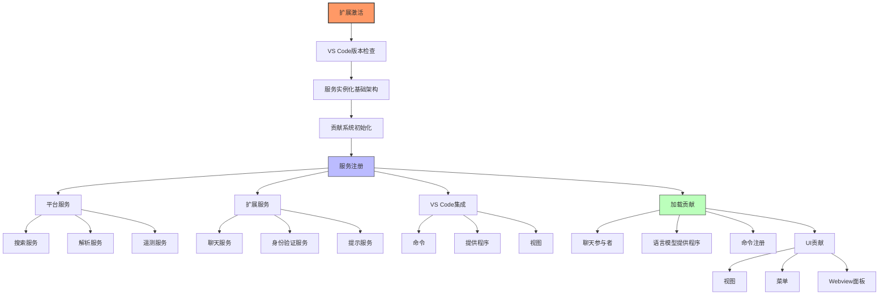
```mermaid
flowchart TD
    Activation[扩展激活] --> VersionCheck[VS Code版本检查]
    VersionCheck --> ServiceInfra[服务实例化基础架构]
    ServiceInfra --> ContribSystem[贡献系统初始化]

    ContribSystem --> RegisterServices[服务注册]
    RegisterServices --> Platform[平台服务]
    RegisterServices --> Extension[扩展服务]
    RegisterServices --> VSCode[VS Code集成]

    Platform --> SearchService[搜索服务]
    Platform --> ParserService[解析服务]
    Platform --> TelemetryService[遥测服务]

    Extension --> ChatService[聊天服务]
    Extension --> AuthService[身份验证服务]
    Extension --> PromptService[提示服务]

    VSCode --> Commands[命令]
    VSCode --> Providers[提供程序]
    VSCode --> Views[视图]

    RegisterServices --> LoadContributions[加载贡献]
    LoadContributions --> ChatParticipants[聊天参与者]
    LoadContributions --> ModelProviders[语言模型提供程序]
    LoadContributions --> CommandsReg[命令注册]
    LoadContributions --> UIContrib[UI贡献]

    UIContrib --> Views2[视图]
    UIContrib --> Menus[菜单]
    UIContrib --> WebviewPanels[Webview面板]

    style Activation fill:#f96,stroke:#333,stroke-width:2px
    style RegisterServices fill:#bbf,stroke:#333,stroke-width:1px
    style LoadContributions fill:#bfb,stroke:#333,stroke-width:1px
```

这个流程图显示了扩展激活过程中的主要步骤，从初始激活到服务注册和贡献加载。这个分层的初始化过程确保了所有必要的组件在被其他组件使用之前已正确初始化和注册。

### 2.5 架构概览图

下图展示了 GitHub Copilot Chat 的整体架构和主要组件的关系：

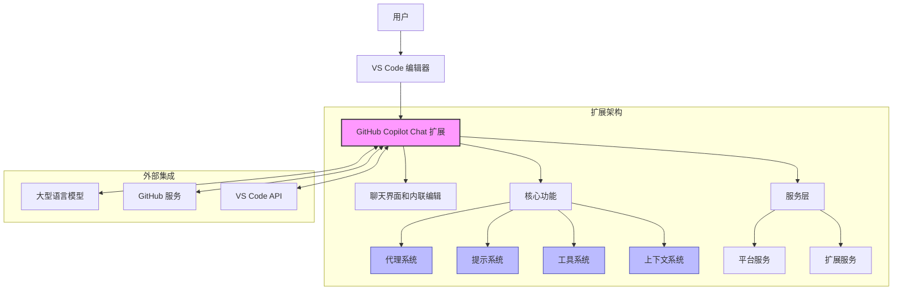
```mermaid
graph TD
    User[用户] --> VSCode[VS Code 编辑器]
    VSCode --> Extension[GitHub Copilot Chat 扩展]

    subgraph "扩展架构"
        Extension --> UI[聊天界面和内联编辑]
        Extension --> Core[核心功能]
        Extension --> Services[服务层]

        Core --> AgentSystem[代理系统]
        Core --> PromptSystem[提示系统]
        Core --> ToolSystem[工具系统]
        Core --> ContextSystem[上下文系统]

        Services --> PlatformServices[平台服务]
        Services --> ExtensionServices[扩展服务]
    end

    subgraph "外部集成"
        Extension <--> LLM[大型语言模型]
        Extension <--> GitHub[GitHub 服务]
        Extension <--> VSCodeAPI[VS Code API]
    end

    style Extension fill:#f9f,stroke:#333,stroke-width:2px
    style AgentSystem fill:#bbf,stroke:#33a,stroke-width:1px
    style PromptSystem fill:#bbf,stroke:#33a,stroke-width:1px
    style ToolSystem fill:#bbf,stroke:#33a,stroke-width:1px
    style ContextSystem fill:#bbf,stroke:#33a,stroke-width:1px
```

这个架构图显示了用户如何通过 VS Code 与 GitHub Copilot Chat 扩展交互，以及扩展内部的主要组件和外部集成。

## 3. 核心组件分析

### 3.1 核心提示系统

Copilot Chat 的提示系统是基于 TSX 的声明式提示工程系统。核心文件位于：

- **[`agentPrompt.tsx`](./src/extension/prompts/node/agent/agentPrompt.tsx)**: 代理模式提示的主要入口点
- **[`agentInstructions.tsx`](./src/extension/prompts/node/agent/agentInstructions.tsx)**: 代理模式系统提示

代理模式提示包括几个关键组件：

1. **`AgentPrompt`** 类：主要的提示协调器，处理整体的代理提示渲染
2. **`DefaultAgentPrompt`** 类：标准代理行为指令
3. **`SweBenchAgentPrompt`** 类：高级问题解决模式指令
4. **`AgentUserMessage`** 类：处理用户输入和环境上下文
5. **`GlobalAgentContext`** 类：提供环境和工作区信息

提示系统使用 TSX 来构建，这使得提示更加结构化和可维护：

```tsx
async render(state: void, sizing: PromptSizing) {
    const instructions = this.configurationService.getConfig(ConfigKey.Internal.SweBenchAgentPrompt) ?
        <SweBenchAgentPrompt availableTools={this.props.promptContext.tools?.availableTools} modelFamily={this.props.endpoint.family} codesearchMode={undefined} /> :
        <DefaultAgentPrompt
            availableTools={this.props.promptContext.tools?.availableTools}
            modelFamily={this.props.endpoint.family}
            codesearchMode={this.props.codesearchMode}
        />;

    const baseInstructions = <>
        <SystemMessage>
            You are an expert AI programming assistant, working with a user in the VS Code editor.<br />
            <CopilotIdentityRules />
            <SafetyRules />
        </SystemMessage>
        // ...其他提示组件
    </>;
}
```

### 3.2 代理模式实现

代理模式是 Copilot Chat 的核心功能，它允许 AI 自主执行多步骤编码任务。关键实现文件：

- **[`toolCallingLoop.ts`](./src/extension/intents/node/toolCallingLoop.ts)**: 运行代理循环
- **[`chatParticipants.ts`](./src/extension/conversation/vscode-node/chatParticipants.ts)**: 注册代理模式和其他参与者
- **[`agentIntent.ts`](./src/extension/intents/node/agentIntent.ts)**: 代理意图处理

代理模式工作流程：

1. **请求分析**：解析用户输入，包括参与者、变量和命令
2. **上下文收集**：收集相关代码上下文、诊断信息和工作区信息
3. **提示构建**：基于上下文和意图检测构建提示
4. **模型交互**：向适当的语言模型发送请求
5. **响应处理**：解析和解释 AI 响应
6. **工具执行**：应用代码编辑、显示结果、处理后续操作

下图展示了代理模式的工作流程及关键组件之间的交互：

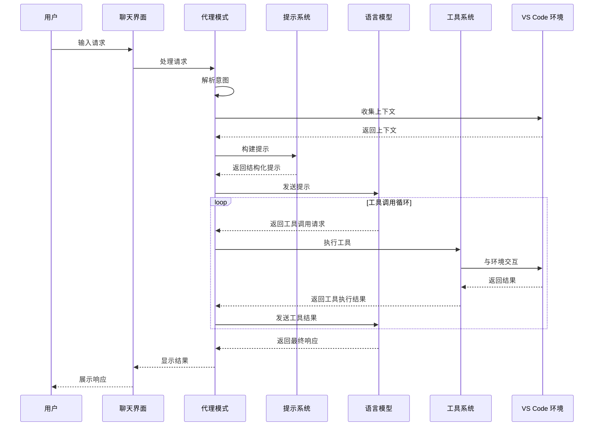
```mermaid
sequenceDiagram
    participant User as 用户
    participant ChatUI as 聊天界面
    participant Agent as 代理模式
    participant Prompt as 提示系统
    participant LLM as 语言模型
    participant Tools as 工具系统
    participant VSCode as VS Code 环境

    User->>ChatUI: 输入请求
    ChatUI->>Agent: 处理请求
    Agent->>Agent: 解析意图

    Agent->>VSCode: 收集上下文
    VSCode-->>Agent: 返回上下文

    Agent->>Prompt: 构建提示
    Prompt-->>Agent: 返回结构化提示

    Agent->>LLM: 发送提示

    loop 工具调用循环
        LLM-->>Agent: 返回工具调用请求
        Agent->>Tools: 执行工具
        Tools->>VSCode: 与环境交互
        VSCode-->>Tools: 返回结果
        Tools-->>Agent: 返回工具执行结果
        Agent->>LLM: 发送工具结果
    end

    LLM-->>Agent: 返回最终响应
    Agent-->>ChatUI: 显示结果
    ChatUI-->>User: 展示响应
```

这个序列图展示了代理模式如何通过工具调用循环来执行复杂的多步骤任务。代理首先收集上下文并构建提示，然后与语言模型进行多轮交互，每次接收模型的工具调用请求并执行，直到完成任务并返回最终响应。

### 3.3 工具系统

工具系统是代理模式的核心部分，允许 AI 与 VS Code 环境交互。工具的定义和实现位于：

- **[`package.json`](./package.json)**: 工具描述和模式
- **[`toolNames.ts`](./src/extension/tools/common/toolNames.ts)**: 模型面向的工具名称
- **[`tools/`](./src/extension/tools/node/)**: 工具实现

主要工具类别包括：

1. **核心开发工具**:
   - 读取文件 (`read_file`)
   - 编辑文件 (`insert_edit_into_file`, `replace_string_in_file`)
   - 运行终端命令 (`run_in_terminal`)

2. **分析工具**:
   - 语义搜索 (`semantic_search`)
   - 文件搜索 (`file_search`)
   - 文本搜索 (`grep_search`)

3. **执行工具**:
   - 运行任务 (`run_vs_code_task`)
   - 运行测试 (`run_tests`)
   - 执行笔记本单元格 (`run_notebook_cell`)

4. **其他工具**:
   - 创建文件 (`create_file`)
   - 获取错误 (`get_errors`)
   - 修改用户首选项 (`update_user_preferences`)

下图展示了工具系统的架构及主要工具类别：

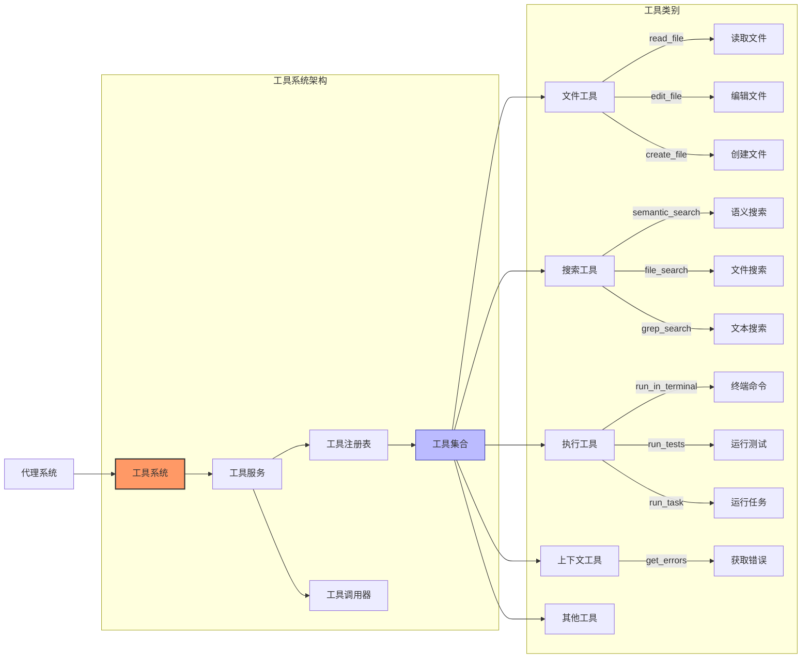
```mermaid
graph LR
    Agent[代理系统] --> ToolsSystem[工具系统]

    subgraph "工具系统架构"
        ToolsSystem --> ToolsService[工具服务]
        ToolsService --> ToolRegistry[工具注册表]
        ToolsService --> ToolInvoker[工具调用器]

        ToolRegistry --> Tools[工具集合]
    end

    subgraph "工具类别"
        Tools --> FileTools[文件工具]
        Tools --> SearchTools[搜索工具]
        Tools --> ExecutionTools[执行工具]
        Tools --> ContextTools[上下文工具]
        Tools --> MiscTools[其他工具]

        FileTools --> |read_file| ReadFile[读取文件]
        FileTools --> |edit_file| EditFile[编辑文件]
        FileTools --> |create_file| CreateFile[创建文件]

        SearchTools --> |semantic_search| SemanticSearch[语义搜索]
        SearchTools --> |file_search| FileSearch[文件搜索]
        SearchTools --> |grep_search| GrepSearch[文本搜索]

        ExecutionTools --> |run_in_terminal| Terminal[终端命令]
        ExecutionTools --> |run_tests| Tests[运行测试]
        ExecutionTools --> |run_task| Tasks[运行任务]

        ContextTools --> |get_errors| Errors[获取错误]
    end

    style ToolsSystem fill:#f96,stroke:#333,stroke-width:2px
    style Tools fill:#bbf,stroke:#33a,stroke-width:1px
```

这个图表展示了工具系统的主要组件和分类。工具系统是代理能力的核心，通过多种工具类别（文件操作、搜索、执行等）使 AI 能够与 VS Code 环境进行有效交互。

### 3.4 聊天系统

聊天系统是用户与 AI 交互的主要方式。核心组件：

#### 聊天参与者
- **Default Agent**: 主要对话 AI 助手
- **Setup Agent**: 处理初始 Copilot 设置和入职
- **Workspace Agent**: 专门用于工作区范围操作
- **Agent Mode**: 自主多步骤任务执行

实现位于：[`src/extension/conversation/`](./src/extension/conversation/) 目录中。

#### 消息处理流程

消息处理流程涉及多个步骤：

1. 接收用户输入
2. 解析参与者和命令
3. 收集上下文
4. 构建提示
5. 与 AI 模型交互
6. 处理响应并显示结果

下图展示了聊天系统的消息处理流程：

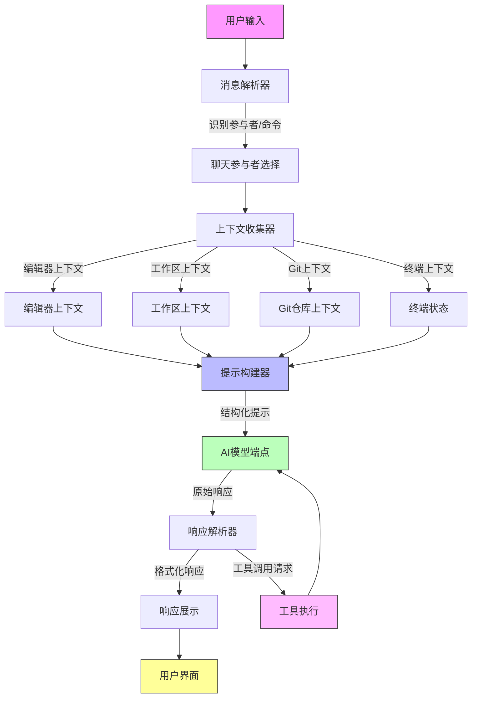
```mermaid
flowchart TD
    Input[用户输入] --> Parser[消息解析器]
    Parser --> |识别参与者/命令| Participant[聊天参与者选择]

    Participant --> Context[上下文收集器]
    Context --> |编辑器上下文| Collector1[编辑器上下文]
    Context --> |工作区上下文| Collector2[工作区上下文]
    Context --> |Git上下文| Collector3[Git仓库上下文]
    Context --> |终端上下文| Collector4[终端状态]

    Collector1 --> Prompt[提示构建器]
    Collector2 --> Prompt
    Collector3 --> Prompt
    Collector4 --> Prompt

    Prompt --> |结构化提示| Endpoint[AI模型端点]

    Endpoint --> |原始响应| Parser2[响应解析器]
    Parser2 --> |格式化响应| Display[响应展示]
    Parser2 --> |工具调用请求| Tools[工具执行]
    Tools --> Endpoint

    Display --> UI[用户界面]

    style Input fill:#f9f,stroke:#333,stroke-width:1px
    style Prompt fill:#bbf,stroke:#333,stroke-width:1px
    style Endpoint fill:#bfb,stroke:#333,stroke-width:1px
    style Tools fill:#fbf,stroke:#333,stroke-width:1px
    style UI fill:#ff9,stroke:#333,stroke-width:1px
```

这个流程图展示了从用户输入到最终展示的整个消息处理过程，包括参与者选择、上下文收集、提示构建、模型交互和响应处理等关键步骤。

## 4. 构建和依赖

### 4.1 主要依赖项

项目的主要依赖项在 `package.json` 中定义：

```json
{
    "dependencies": {
        "@anthropic-ai/sdk": "^0.55.0",
        "@humanwhocodes/gitignore-to-minimatch": "1.0.2",
        "@microsoft/tiktokenizer": "^1.0.10",
        "@roamhq/mac-ca": "^1.0.7",
        "@vscode/copilot-api": "^0.1.1",
        "@vscode/extension-telemetry": "^1.0.0",
        "@vscode/l10n": "^0.0.18",
        "@vscode/prompt-tsx": "^0.4.0-alpha.5",
        "@vscode/tree-sitter-wasm": "^0.0.5",
        "@xterm/headless": "^5.5.0",
        // ...其他依赖项
    }
}
```

核心依赖包括：

- **@vscode/prompt-tsx**: 用于构建 AI 提示的 TSX 库
- **@vscode/tree-sitter-wasm**: 用于代码解析的 WebAssembly 组件
- **@anthropic-ai/sdk**: Anthropic Claude 模型集成
- **@microsoft/tiktokenizer**: 用于 OpenAI 模型的令牌计数

以下图表展示了主要依赖项及其在系统中的用途：

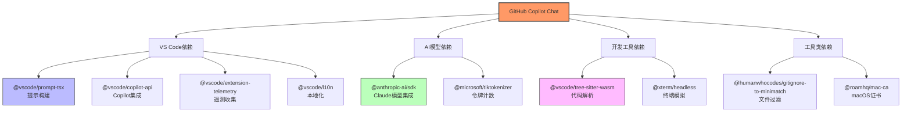
```mermaid
graph TD
    Copilot[GitHub Copilot Chat] --> VSCodeDeps[VS Code依赖]
    Copilot --> AIDeps[AI模型依赖]
    Copilot --> DevDeps[开发工具依赖]
    Copilot --> UtilDeps[工具类依赖]

    VSCodeDeps --> PromptTSX["@vscode/prompt-tsx<br>提示构建"]
    VSCodeDeps --> CopilotAPI["@vscode/copilot-api<br>Copilot集成"]
    VSCodeDeps --> Telemetry["@vscode/extension-telemetry<br>遥测收集"]
    VSCodeDeps --> L10n["@vscode/l10n<br>本地化"]

    AIDeps --> AnthropicSDK["@anthropic-ai/sdk<br>Claude模型集成"]
    AIDeps --> Tiktokenizer["@microsoft/tiktokenizer<br>令牌计数"]

    DevDeps --> TreeSitterWasm["@vscode/tree-sitter-wasm<br>代码解析"]
    DevDeps --> XtermHeadless["@xterm/headless<br>终端模拟"]

    UtilDeps --> GitignoreToMinimatch["@humanwhocodes/gitignore-to-minimatch<br>文件过滤"]
    UtilDeps --> MacCa["@roamhq/mac-ca<br>macOS证书"]

    style Copilot fill:#f96,stroke:#333,stroke-width:2px
    style PromptTSX fill:#bbf,stroke:#333,stroke-width:1px
    style AnthropicSDK fill:#bfb,stroke:#333,stroke-width:1px
    style TreeSitterWasm fill:#fbf,stroke:#333,stroke-width:1px
```

这个图表展示了GitHub Copilot Chat扩展的主要依赖项，按功能分为VS Code集成、AI模型集成、开发工具和通用工具四大类。每个依赖项都标注了其在系统中的主要用途。

### 4.2 构建系统

项目使用 ESBuild 进行构建，配置文件在 `.esbuild.ts` 中定义：

```typescript
const baseBuildOptions = {
    bundle: true,
    logLevel: 'info',
    minify: !isDev,
    outdir: './dist',
    sourcemap: isDev ? 'linked' : false,
    sourcesContent: false,
    treeShaking: true
} satisfies esbuild.BuildOptions;

const baseNodeBuildOptions = {
    // ...Node.js 特定配置
    external: [
        './package.json',
        './.vscode-test.mjs',
        'playwright',
        // ...其他外部依赖
    ],
    platform: 'node',
    // ...其他选项
} satisfies esbuild.BuildOptions;
```

### 4.3 构建脚本

项目的构建脚本定义在 `package.json` 的 `scripts` 部分：

- **`compile`**: 编译整个项目
- **`watch:tsc-extension`**: 监视扩展 TypeScript 代码并重新编译
- **`watch:tsc-extension-web`**: 监视 Web 扩展代码并重新编译
- **`watch:esbuild`**: 使用 ESBuild 监视构建

这些任务可以通过 VS Code 的任务系统运行。

## 5. 关键代码逻辑

### 5.1 代理指令系统

代理指令系统是代理能力的核心，在 [`agentInstructions.tsx`](./src/extension/prompts/node/agent/agentInstructions.tsx) 中定义。这些指令控制代理的行为、能力和约束。

关键指令组件：

1. **`DefaultAgentPrompt`**：标准的代理行为指导：

```tsx
async render(state: void, sizing: PromptSizing) {
    // ...
    return <InstructionMessage>
        <Tag name='instructions'>
            You are a highly sophisticated automated coding agent with expert-level knowledge across many different programming languages and frameworks.<br />
            // ...更多指令
        </Tag>
        // ...工具使用说明、编辑说明等
    </InstructionMessage>;
}
```

2. **`SweBenchAgentPrompt`**：用于特定评估的高级代理指令：

```tsx
async render(state: void, sizing: PromptSizing) {
    // ...
    return <InstructionMessage>
        <Tag name='agentInstructions'>
            You are a highly sophisticated automated coding agent with expert-level knowledge across many different programming languages and frameworks.<br />
            // ...更多专业指令
        </Tag>
        // ...特殊工具使用说明
    </InstructionMessage>;
}
```

### 5.2 工具调用循环

工具调用循环在 [`toolCallingLoop.ts`](./src/extension/intents/node/toolCallingLoop.ts) 中实现，它管理 AI 模型与工具之间的交互。核心逻辑是：

1. 发送提示到语言模型
2. 接收并解析工具调用请求
3. 执行请求的工具
4. 将工具结果返回给模型
5. 继续这个过程直到模型完成响应

```typescript
// 简化的工具调用循环逻辑
async function runToolCallingLoop(
    options: IToolCallingLoopOptions,
    request: ChatRequest,
    progress: Progress<ChatResponseProgressPart | ChatResponseReferencePart>,
    token: CancellationToken
): Promise<ChatResult> {
    // 初始化
    const { conversation, toolCallLimit } = options;

    // 循环直到完成或取消
    while (!token.isCancellationRequested) {
        // 发送提示到模型
        const response = await sendPromptToModel();

        // 解析工具调用
        const toolCalls = parseToolCalls(response);

        // 如果没有工具调用，则完成
        if (toolCalls.length === 0) {
            return finalizeResponse();
        }

        // 执行工具调用
        const toolResults = await executeToolCalls(toolCalls);

        // 将结果加入对话
        addToolResultsToConversation(toolResults);
    }

    // 处理取消
    return handleCancellation();
}
```

### 5.3 上下文收集

上下文收集机制允许代理了解用户的工作区和当前编辑器状态。主要组件位于 [`src/extension/context/`](./src/extension/context/) 目录中：

1. **当前编辑器上下文**：收集当前编辑器中的代码
2. **工作区结构**：提供工作区文件和文件夹的概览
3. **Git 存储库上下文**：收集有关 Git 存储库的信息
4. **终端状态**：收集终端状态和命令历史

上下文收集在代理提示的 `AgentUserMessage` 类中使用：

```tsx
async render(state: void, sizing: PromptSizing) {
    // ...
    return <>
        <Tag name='context'>
            <CurrentEditorContext endpoint={this.props.endpoint} />
            <RepoContext />
            <TerminalCwdPrompt sessionId={this.props.sessionId} />
            <TerminalAndTaskStatePromptElement sessionId={this.props.sessionId} />
        </Tag>
        // ...其他上下文和提示
    </>;
}
```

### 5.4 核心组件类关系图

以下类图展示了代理模式的核心组件及其关系：

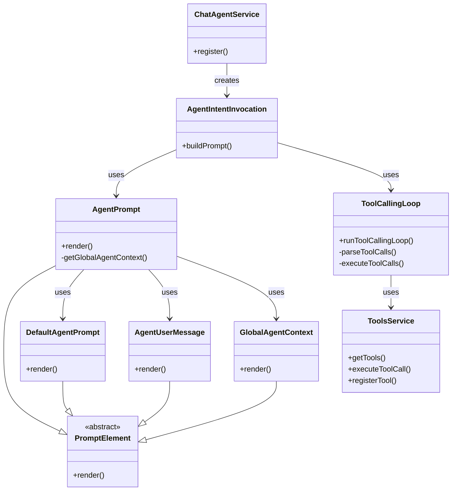
```mermaid
classDiagram
    class AgentPrompt {
        +render()
        -getGlobalAgentContext()
    }

    class DefaultAgentPrompt {
        +render()
    }

    class AgentUserMessage {
        +render()
    }

    class GlobalAgentContext {
        +render()
    }

    class ToolCallingLoop {
        +runToolCallingLoop()
        -parseToolCalls()
        -executeToolCalls()
    }

    class ChatAgentService {
        +register()
    }

    class ToolsService {
        +getTools()
        +executeToolCall()
        +registerTool()
    }

    class AgentIntentInvocation {
        +buildPrompt()
    }

    AgentPrompt --|> PromptElement
    DefaultAgentPrompt --|> PromptElement
    AgentUserMessage --|> PromptElement
    GlobalAgentContext --|> PromptElement

    AgentPrompt --> DefaultAgentPrompt : uses
    AgentPrompt --> AgentUserMessage : uses
    AgentPrompt --> GlobalAgentContext : uses

    AgentIntentInvocation --> AgentPrompt : uses
    AgentIntentInvocation --> ToolCallingLoop : uses

    ChatAgentService --> AgentIntentInvocation : creates

    ToolCallingLoop --> ToolsService : uses

    class PromptElement {
        <<abstract>>
        +render()
    }
```

这个类图展示了代理模式的核心类和它们之间的关系。`AgentPrompt` 是核心提示类，它使用 `DefaultAgentPrompt`、`AgentUserMessage` 和 `GlobalAgentContext` 来构建完整的提示。`AgentIntentInvocation` 处理用户意图并使用 `ToolCallingLoop` 执行工具调用。所有提示相关的类都继承自抽象基类 `PromptElement`，提供统一的渲染接口。

## 6. 关键路径链接

本节提供项目中关键文件的链接，以便于导航和理解代码库：

### 6.1 核心架构文件

- [**项目架构说明**](./CONTRIBUTING.md) - 贡献指南，包含架构信息
- [**扩展主入口点**](./src/extension/extension/vscode-node/extension.ts) - 扩展激活和注册

### 6.2 代理模式文件

- [**代理提示**](./src/extension/prompts/node/agent/agentPrompt.tsx) - 代理模式提示的主入口点
- [**代理指令**](./src/extension/prompts/node/agent/agentInstructions.tsx) - 代理模式系统提示
- [**工具调用循环**](./src/extension/intents/node/toolCallingLoop.ts) - 运行代理循环
- [**聊天参与者**](./src/extension/conversation/vscode-node/chatParticipants.ts) - 注册代理模式和其他参与者

### 6.3 工具系统文件

- [**工具名称**](./src/extension/tools/common/toolNames.ts) - 模型面向的工具名称
- **[`工具服务`](./src/extension/tools/node/toolsService.ts)** - 工具服务实现
- **[`工具定义`](./package.json)** - 工具描述和模式（在 `contributes.languageModelTools` 部分）

### 6.4 构建文件

- **[`ESBuild 配置`](./.esbuild.ts)** - ESBuild 配置文件
- **[`Package.json`](./package.json)** - 项目依赖和脚本

### 6.5 部署架构图

下图展示了 GitHub Copilot Chat 的部署架构和组件交互：

```mermaid
flowchart TB
    subgraph "用户环境"
        VSCode["VS Code"]
        Extension["GitHub Copilot Chat 扩展"]

        VSCode --- Extension
    end

    subgraph "GitHub 云服务"
        Auth["GitHub 认证服务"]
        Copilot["Copilot 服务"]

        Auth --- Copilot
    end

    subgraph "AI 服务"
        OpenAI["OpenAI API"]
        Claude["Anthropic Claude API"]
        Other["其他 AI 模型"]

        OpenAI --- ModelRouter
        Claude --- ModelRouter
        Other --- ModelRouter
    end

    Extension <--> Auth : "认证请求"
    Extension <--> Copilot : "服务集成"
    Extension <--> ModelRouter["模型路由器"] : "模型请求"

    class Extension,Copilot,ModelRouter highlight
```

这个流程图展示了 GitHub Copilot Chat 扩展如何与各种外部服务交互。扩展在本地 VS Code 环境中运行，但需要与 GitHub 的认证和 Copilot 服务进行交互，同时还会与多种 AI 模型 API 进行通信。这种架构使得扩展能够灵活地支持多种 AI 模型，同时保持与 GitHub 生态系统的紧密集成。

## 7. 总结

GitHub Copilot Chat 是一个复杂的多层系统，提供 VS Code 中全面的 AI 辅助功能。其核心是基于 TSX 的提示系统和工具生态系统，使 AI 能够与用户的编码环境进行有意义的交互。

### 7.1 最佳实践与性能优化

GitHub Copilot Chat 扩展采用了多种最佳实践和性能优化技术，以确保在 VS Code 中的流畅体验：

1. **延迟加载**：非核心功能使用延迟加载，减少启动时间
2. **提示优化**：经过精心优化的提示结构，减少令牌使用并提高响应质量
3. **缓存机制**：多层缓存系统，减少重复计算和网络请求
4. **并行处理**：在可能的情况下使用并行处理，如语义搜索和上下文收集
5. **增量更新**：仅处理变更的工作区部分，而不是完整重建
6. **内存管理**：严格的内存使用策略，避免内存泄漏和过度使用
7. **错误恢复**：优雅的错误处理和恢复机制

下图展示了 Copilot Chat 中的主要性能优化技术：

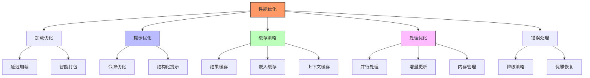
```mermaid
graph TB
    Performance[性能优化] --> Loading[加载优化]
    Performance --> Prompts[提示优化]
    Performance --> Caching[缓存策略]
    Performance --> Processing[处理优化]
    Performance --> ErrorHandling[错误处理]

    Loading --> LazyLoading[延迟加载]
    Loading --> Bundling[智能打包]

    Prompts --> TokenOptimization[令牌优化]
    Prompts --> StructuredPrompts[结构化提示]

    Caching --> ResultCache[结果缓存]
    Caching --> EmbeddingCache[嵌入缓存]
    Caching --> ContextCache[上下文缓存]

    Processing --> Parallelization[并行处理]
    Processing --> Incremental[增量更新]
    Processing --> MemoryManagement[内存管理]

    ErrorHandling --> Fallbacks[降级策略]
    ErrorHandling --> GracefulRecovery[优雅恢复]

    style Performance fill:#f96,stroke:#333,stroke-width:2px
    style Prompts fill:#bbf,stroke:#333,stroke-width:1px
    style Caching fill:#bfb,stroke:#333,stroke-width:1px
    style Processing fill:#fbf,stroke:#333,stroke-width:1px
```

这些最佳实践和性能优化技术确保了 GitHub Copilot Chat 在各种工作区规模和复杂度下都能保持高响应性和用户体验。

### 7.2 架构特点

该扩展的架构体现了以下关键特点：

1. **模块化设计**：功能按照逻辑分组，而不是技术层
2. **服务导向**：大量使用依赖注入和 `IInstantiationService`
3. **贡献系统**：模块化系统，功能自行注册
4. **事件驱动**：广泛使用 VS Code 的事件系统和可处置对象
5. **分层架构**：明确分离平台服务和扩展功能

通过这种架构，Copilot Chat 能够作为真正的 AI 结对编程助手运行，理解复杂的需求，规划解决方案，并执行多步编码任务，同时保持对开发环境的全面感知。

### 7.3 未来发展方向

基于当前的架构和代码库，GitHub Copilot Chat 有几个潜在的发展方向：

1. **多模型协作**：增强多种 AI 模型协作能力，不同任务使用最适合的模型
2. **本地模型支持**：集成本地部署的 AI 模型，提高隐私保护和减少延迟
3. **高级工具集成**：扩展工具系统，集成更多专业开发工具和服务
4. **团队协作**：增强多用户协作功能，支持团队共享上下文和 AI 辅助
5. **领域特定优化**：为特定编程语言和框架提供深度优化的体验
6. **更多智能自动化**：自动化更复杂的开发任务，如测试生成和重构
7. **可定制代理**：允许用户创建和定制专门的代理，适应不同开发任务

下图展示了这些潜在的发展方向及其关系：

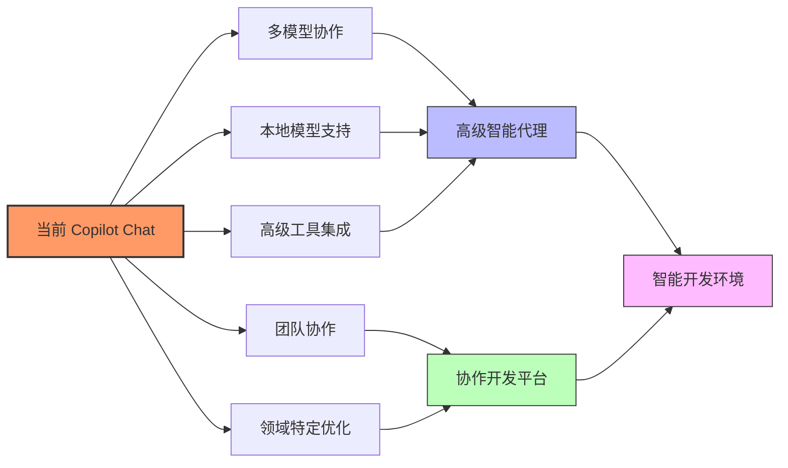
```mermaid
graph LR
    Current[当前 Copilot Chat] --> ModelCollab[多模型协作]
    Current --> LocalModels[本地模型支持]
    Current --> ToolsIntegration[高级工具集成]
    Current --> TeamCollab[团队协作]
    Current --> DomainOptimization[领域特定优化]

    ModelCollab --> AdvancedAgents[高级智能代理]
    LocalModels --> AdvancedAgents
    ToolsIntegration --> AdvancedAgents

    TeamCollab --> CollaborativeDev[协作开发平台]
    DomainOptimization --> CollaborativeDev

    AdvancedAgents --> FutureVision[智能开发环境]
    CollaborativeDev --> FutureVision

    style Current fill:#f96,stroke:#333,stroke-width:2px
    style AdvancedAgents fill:#bbf,stroke:#333,stroke-width:1px
    style CollaborativeDev fill:#bfb,stroke:#333,stroke-width:1px
    style FutureVision fill:#fbf,stroke:#333,stroke-width:1px
```

这些发展方向将进一步增强 GitHub Copilot Chat 作为开发者智能助手的能力，使其能够处理更复杂的任务，提供更个性化的辅助，并更无缝地集成到开发工作流中。随着基础 AI 模型能力的不断提高，Copilot Chat 的功能也将持续扩展，为软件开发提供更强大的支持。

## 8. 语言模型集成与工作区理解

### 8.1 大模型 API 调用方式

GitHub Copilot Chat 通过一套灵活的抽象层与多种 AI 模型进行交互。核心实现位于 [`src/extension/endpoint/`](./src/extension/endpoint/) 和 [`src/platform/openai/`](./src/platform/openai/) 目录。

#### 8.1.1 核心 API 抽象

语言模型 API 调用的核心抽象层包含以下关键组件：

1. **`LanguageModelService`**：负责管理多种语言模型端点和路由请求
2. **`EndpointService`**：提供不同模型端点的配置和管理
3. **`ChatModelRequestHandler`**：处理具体的模型请求流程
4. **`VscodeLanguageModelProxy`**：使用 VS Code 的语言模型 API 进行本地调用

关键代码流程示例：

```typescript
// 创建一个语言模型请求
const request = {
    prompt: [
        { role: 'system', content: '...' },
        { role: 'user', content: '...' }
    ],
    options: {
        temperature: 0.7,
        maxTokens: 1000,
        toolDefinitions: [...toolDefinitions]
    }
};

// 发送请求到适当的模型端点
const response = await this.endpointService.sendRequest(
    selectedModel,
    request,
    cancellationToken
);
```

#### 8.1.2 API 请求流程

模型 API 请求流程如下：

1. 构建提示（系统消息、工具定义、用户查询）
2. 选择合适的模型端点（基于配置或回退策略）
3. 发送请求到 API 并处理流式响应
4. 解析响应，包括文本内容和工具调用
5. 在需要时处理工具调用并继续对话

以下流程图展示了 API 请求的详细流程：

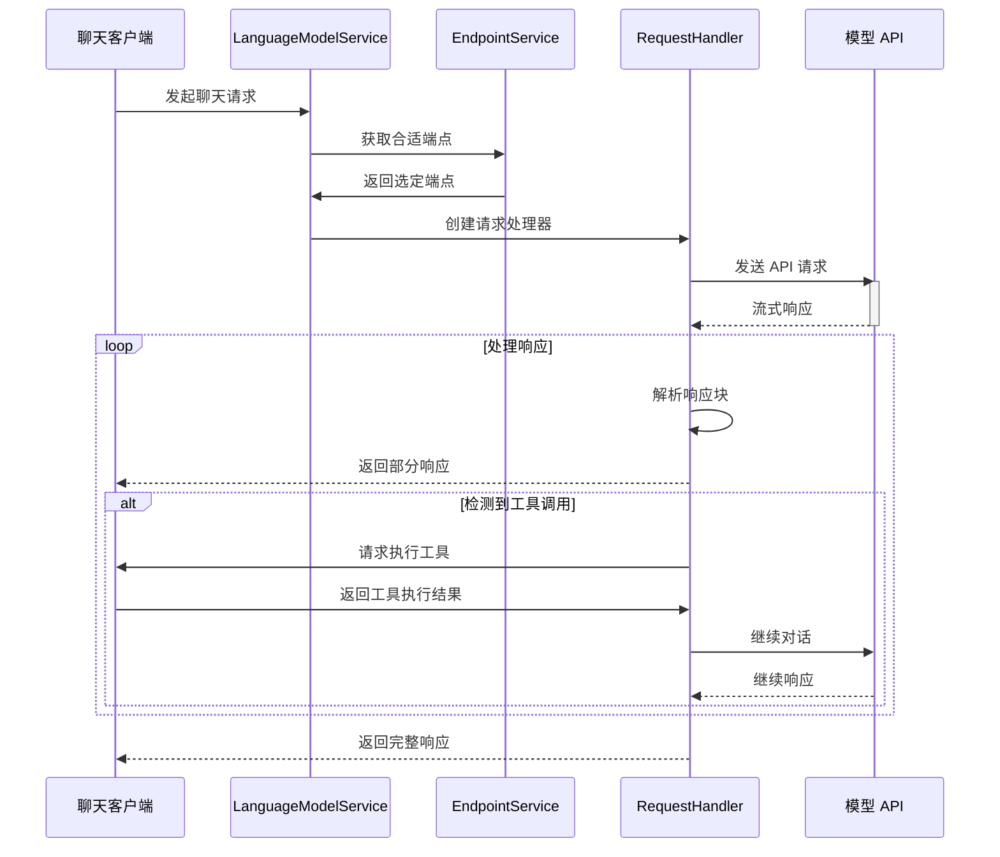
```mermaid
sequenceDiagram
    participant Client as 聊天客户端
    participant LMS as LanguageModelService
    participant EP as EndpointService
    participant Handler as RequestHandler
    participant API as 模型 API

    Client->>LMS: 发起聊天请求
    LMS->>EP: 获取合适端点
    EP->>LMS: 返回选定端点
    LMS->>Handler: 创建请求处理器

    Handler->>API: 发送 API 请求
    activate API
    API-->>Handler: 流式响应
    deactivate API

    loop 处理响应
        Handler->>Handler: 解析响应块
        Handler-->>Client: 返回部分响应

        alt 检测到工具调用
            Handler->>Client: 请求执行工具
            Client->>Handler: 返回工具执行结果
            Handler->>API: 继续对话
            API-->>Handler: 继续响应
        end
    end

    Handler-->>Client: 返回完整响应
```

### 8.2 多模型支持机制

Copilot Chat 支持多种语言模型，包括 OpenAI、Anthropic Claude、以及未来可能的其他模型。多模型支持机制的核心设计包括：

#### 8.2.1 模型路由与选择

1. **模型注册系统**：
   - 在 [`src/extension/endpoint/vscode/modelRegistrationService.ts`](./src/extension/endpoint/vscode/modelRegistrationService.ts) 中实现
   - 允许动态注册不同提供商的语言模型

2. **模型选择策略**：
   - 基于用户配置自动选择模型
   - 实现自动回退机制，当首选模型不可用时切换到替代模型
   - 支持特定功能对模型能力的最低要求

```typescript
// 模型选择示例代码
async selectModelForRequest(request: ChatModelRequest): Promise<ModelInfo> {
    // 获取用户配置的首选模型
    const preferredModel = this.configService.getPreferredModel();

    // 检查首选模型是否可用且满足请求要求
    if (await this.isModelAvailable(preferredModel) &&
        this.doesModelMeetRequirements(preferredModel, request.requirements)) {
        return preferredModel;
    }

    // 如果首选模型不可用，选择合适的替代模型
    return await this.selectFallbackModel(request.requirements);
}
```

#### 8.2.2 模型适配器系统

为支持不同的模型 API，Copilot Chat 使用适配器模式处理不同模型的特殊需求：

1. **OpenAI 适配器**：
   - 处理 OpenAI API 特定的请求格式和响应解析
   - 支持 GPT-4、GPT-3.5-Turbo 等模型

2. **Claude 适配器**：
   - 处理 Anthropic Claude API 的特殊格式
   - 包含 Claude 特有的参数映射

3. **通用适配器接口**：
   - 提供统一的方法签名
   - 处理模型特定的参数转换

下图展示了多模型支持的架构：

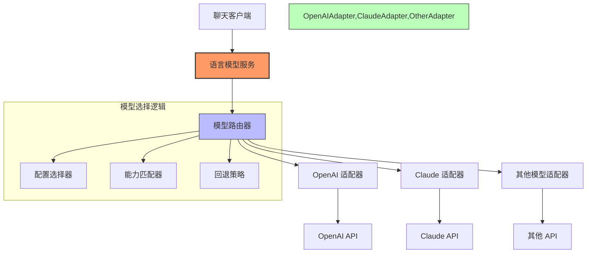
```mermaid
graph TD
    Client[聊天客户端] --> LMS[语言模型服务]
    LMS --> Router[模型路由器]

    Router --> OpenAIAdapter[OpenAI 适配器]
    Router --> ClaudeAdapter[Claude 适配器]
    Router --> OtherAdapter[其他模型适配器]

    OpenAIAdapter --> OpenAIAPI[OpenAI API]
    ClaudeAdapter --> ClaudeAPI[Claude API]
    OtherAdapter --> OtherAPI[其他 API]

    subgraph "模型选择逻辑"
        Router --> ConfigSelector[配置选择器]
        Router --> CapabilityMatcher[能力匹配器]
        Router --> FallbackStrategy[回退策略]
    end

    style LMS fill:#f96,stroke:#333,stroke-width:2px
    style Router fill:#bbf,stroke:#333,stroke-width:1px
    style OpenAIAdapter,ClaudeAdapter,OtherAdapter fill:#bfb,stroke:#333,stroke-width:1px
```

#### 8.2.3 模型特定的提示优化

不同模型具有不同的强项和特性，Copilot Chat 通过动态调整提示来优化每种模型的表现：

1. **动态提示调整**：
   - 在 [`src/extension/prompts/node/agent/agentPrompt.tsx`](./src/extension/prompts/node/agent/agentPrompt.tsx) 中基于模型类型调整提示
   - 为不同模型家族提供优化的指令格式

2. **令牌限制管理**：
   - 基于模型的上下文窗口大小动态调整上下文包含量
   - 使用 `@microsoft/tiktokenizer` 进行准确的令牌计数

```tsx
// 基于模型系列调整提示的示例
async render(state: void, sizing: PromptSizing) {
    const instructions = this.props.modelFamily === 'anthropic' ?
        <ClaudeOptimizedInstructions availableTools={this.props.availableTools} /> :
        <OpenAIOptimizedInstructions availableTools={this.props.availableTools} />;

    // ...提示的其余部分
}
```

### 8.3 工作区理解与代码分析

Copilot Chat 的工作区理解和代码分析功能是其上下文感知能力的核心。这些功能使 AI 助手能够理解用户的代码库并提供相关的帮助。

#### 8.3.1 工作区理解机制

工作区理解由以下组件实现：

1. **`WorkspaceService`**（[`src/platform/workspace/`](./src/platform/workspace/)）：
   - 提供工作区文件和结构的抽象
   - 处理文件系统事件和变更通知

2. **`WorkspaceContextProvider`**（[`src/extension/context/`](./src/extension/context/)）：
   - 收集工作区元数据和项目结构
   - 生成工作区概述以供模型理解

3. **`GitContextProvider`**：
   - 收集 Git 仓库信息，包括分支、远程和变更
   - 提供当前代码变更的上下文

工作区理解流程：

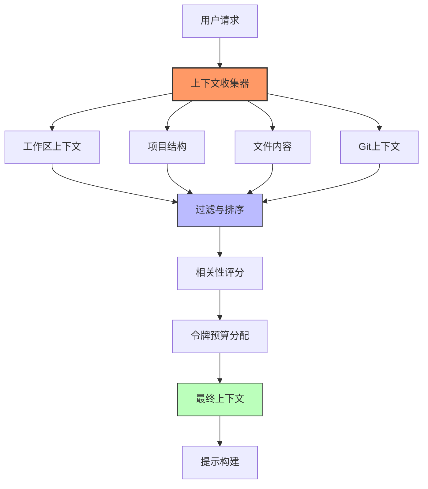
```mermaid
graph TD
    Request[用户请求] --> ContextCollection[上下文收集器]

    ContextCollection --> WorkspaceContext[工作区上下文]
    ContextCollection --> ProjectContext[项目结构]
    ContextCollection --> FileContext[文件内容]
    ContextCollection --> GitContext[Git上下文]

    WorkspaceContext --> Filtering[过滤与排序]
    ProjectContext --> Filtering
    FileContext --> Filtering
    GitContext --> Filtering

    Filtering --> Relevance[相关性评分]
    Relevance --> TokenBudget[令牌预算分配]
    TokenBudget --> FinalContext[最终上下文]

    FinalContext --> Prompt[提示构建]

    style ContextCollection fill:#f96,stroke:#333,stroke-width:2px
    style Filtering fill:#bbf,stroke:#333,stroke-width:1px
    style FinalContext fill:#bfb,stroke:#333,stroke-width:1px
```

#### 8.3.2 语义搜索实现

语义搜索功能让 Copilot Chat 能够找到语义相关的代码，而不仅仅是文本匹配。实现位于 [`src/extension/workspaceSemanticSearch/`](./src/extension/workspaceSemanticSearch/) 和 [`src/platform/embedding/`](./src/platform/embedding/)：

1. **嵌入生成**：
   - 使用语言模型 API 生成代码段的向量表示
   - 对工作区文件进行分块并生成嵌入

2. **嵌入索引**：
   - 构建和维护向量索引
   - 支持增量更新，避免完全重建

3. **相似度搜索**：
   - 计算查询与代码块之间的余弦相似度
   - 根据相似度对结果排序

4. **上下文整合**：
   - 将搜索结果整合到提示中
   - 确保相关代码片段被包含在上下文中

```typescript
// 语义搜索的简化实现
async function semanticSearch(query: string, options: SearchOptions): Promise<SearchResult[]> {
    // 为查询生成嵌入向量
    const queryEmbedding = await this.embeddingService.generateEmbedding(query);

    // 在索引中搜索相似向量
    const results = this.embeddingIndex.search(
        queryEmbedding,
        options.limit,
        options.threshold
    );

    // 整合结果并添加上下文
    return this.addContextToResults(results);
}
```

语义搜索流程图：

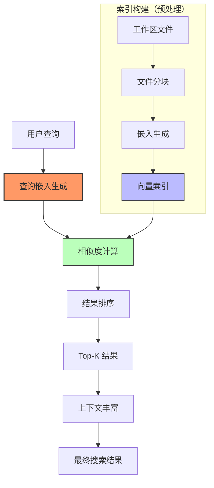
```mermaid
flowchart TD
    Query[用户查询] --> QueryEmbedding[查询嵌入生成]

    subgraph "索引构建（预处理）"
        Files[工作区文件] --> Chunking[文件分块]
        Chunking --> EmbeddingGen[嵌入生成]
        EmbeddingGen --> VectorIndex[向量索引]
    end

    QueryEmbedding --> Similarity[相似度计算]
    VectorIndex --> Similarity

    Similarity --> Ranking[结果排序]
    Ranking --> TopResults[Top-K 结果]
    TopResults --> ContextEnrichment[上下文丰富]

    ContextEnrichment --> FinalResults[最终搜索结果]

    style QueryEmbedding fill:#f96,stroke:#333,stroke-width:2px
    style VectorIndex fill:#bbf,stroke:#333,stroke-width:1px
    style Similarity fill:#bfb,stroke:#333,stroke-width:1px
```

#### 8.3.3 代码分析技术

Copilot Chat 使用多种代码分析技术来理解代码结构和语义：

1. **AST 分析**：
   - 使用 Tree-sitter（通过 `@vscode/tree-sitter-wasm`）进行代码解析
   - 构建和遍历抽象语法树（AST）
   - 实现位于 [`src/platform/parser/`](./src/platform/parser/)

2. **符号解析**：
   - 使用 VS Code 的 `DocumentSymbolProvider` 提取代码符号
   - 识别类、方法、函数和变量的层次结构

3. **依赖分析**：
   - 解析导入语句和包依赖
   - 构建模块依赖图

4. **类型推断**（对于 TypeScript/JavaScript）：
   - 使用语言服务进行类型信息收集
   - 为代码补全和理解提供类型上下文

关键技术示例：

```typescript
// 使用 Tree-sitter 进行代码分析
async function analyzeCode(code: string, language: string): Promise<CodeStructure> {
    // 获取语言特定的解析器
    const parser = await this.parserService.getParser(language);

    // 解析代码得到 AST
    const tree = parser.parse(code);

    // 遍历 AST 提取结构信息
    const visitor = new StructureVisitor();
    visitor.visit(tree.rootNode);

    return visitor.getStructure();
}
```

代码分析架构：

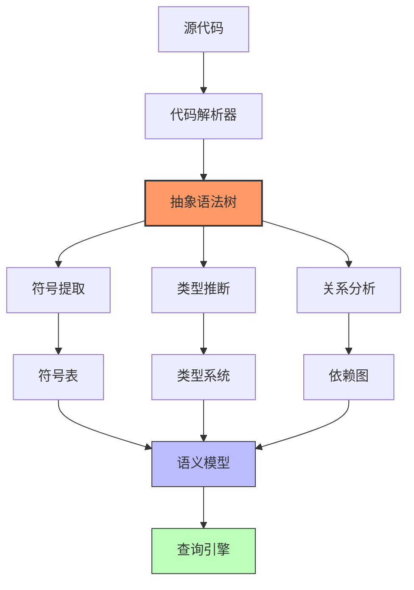
```mermaid
graph TD
    Code[源代码] --> Parser[代码解析器]
    Parser --> AST[抽象语法树]

    AST --> SymbolExtraction[符号提取]
    AST --> TypeInference[类型推断]
    AST --> RelationshipAnalyzer[关系分析]

    SymbolExtraction --> SymbolTable[符号表]
    TypeInference --> TypeSystem[类型系统]
    RelationshipAnalyzer --> DependencyGraph[依赖图]

    SymbolTable --> SemanticModel[语义模型]
    TypeSystem --> SemanticModel
    DependencyGraph --> SemanticModel

    SemanticModel --> QueryEngine[查询引擎]

    style AST fill:#f96,stroke:#333,stroke-width:2px
    style SemanticModel fill:#bbf,stroke:#333,stroke-width:1px
    style QueryEngine fill:#bfb,stroke:#333,stroke-width:1px
```

通过这些代码分析技术，Copilot Chat 能够深入理解代码的结构和意图，提供更加准确和有用的建议和答案。

### 8.4 聊天系统与模型交互的整合

聊天系统与模型交互的整合是 Copilot Chat 的核心功能。这种整合确保了用户输入能够被正确地转换为模型请求，以及模型响应能够被正确地处理和展示。

#### 8.4.1 聊天会话管理

聊天会话管理由以下组件实现：

1. **`ConversationService`**（[`src/extension/conversation/`](./src/extension/conversation/)）：
   - 管理聊天会话的创建、存储和检索
   - 处理消息历史和会话状态

2. **`ChatSessionService`**（[`src/platform/chat/`](./src/platform/chat/)）：
   - 提供会话级别的模型交互抽象
   - 处理上下文窗口管理和消息追踪

3. **`ConversationHistoryService`** :
   - 负责会话历史的持久化和加载
   - 实现会话导出和导入功能

下图展示了聊天系统与模型交互的整合架构：

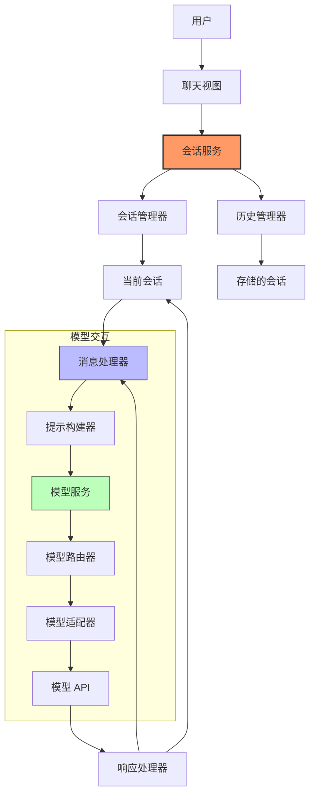
```mermaid
graph TD
    User[用户] --> ChatView[聊天视图]
    ChatView --> ConversationService[会话服务]

    ConversationService --> SessionManager[会话管理器]
    ConversationService --> HistoryManager[历史管理器]

    SessionManager --> CurrentSession[当前会话]
    HistoryManager --> StoredSessions[存储的会话]

    CurrentSession --> MessageProcessor[消息处理器]

    subgraph "模型交互"
        MessageProcessor --> PromptBuilder[提示构建器]
        PromptBuilder --> ModelService[模型服务]
        ModelService --> ModelRouter[模型路由器]
        ModelRouter --> ModelAdapters[模型适配器]
        ModelAdapters --> ModelAPIs[模型 API]
    end

    ModelAPIs --> ResponseProcessor[响应处理器]
    ResponseProcessor --> MessageProcessor
    ResponseProcessor --> CurrentSession

    style ConversationService fill:#f96,stroke:#333,stroke-width:2px
    style MessageProcessor fill:#bbf,stroke:#333,stroke-width:1px
    style ModelService fill:#bfb,stroke:#333,stroke-width:1px
```

#### 8.4.2 上下文管理与注入

Copilot Chat 的一个关键功能是能够将适当的上下文注入到模型对话中。上下文管理由以下组件处理：

1. **`ContextProviderRegistry`**（[`src/extension/context/`](./src/extension/context/)）：
   - 管理多种上下文提供者
   - 处理上下文优先级和冲突

2. **`ContextAwarePromptBuilder`** :
   - 基于对话历史和当前上下文构建提示
   - 处理上下文整合和令牌管理

3. **`ContextSelectionStrategy`** :
   - 实现智能上下文选择策略
   - 确保最相关的上下文被包含在提示中

上下文管理流程：

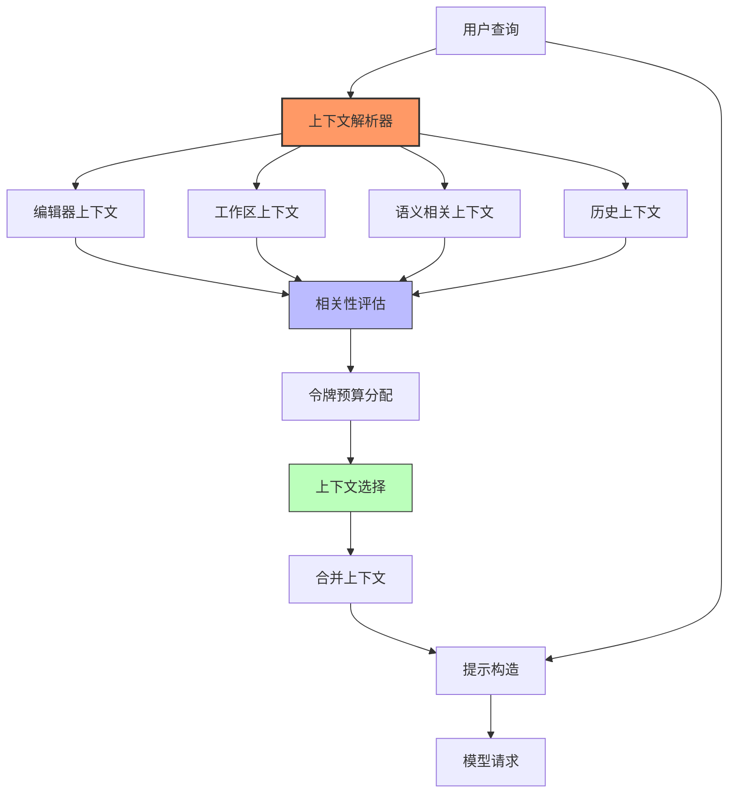
```mermaid
flowchart TD
    UserQuery[用户查询] --> ContextResolver[上下文解析器]

    ContextResolver --> EditorContext[编辑器上下文]
    ContextResolver --> WorkspaceContext[工作区上下文]
    ContextResolver --> SemanticContext[语义相关上下文]
    ContextResolver --> HistoryContext[历史上下文]

    EditorContext --> Relevance[相关性评估]
    WorkspaceContext --> Relevance
    SemanticContext --> Relevance
    HistoryContext --> Relevance

    Relevance --> TokenBudget[令牌预算分配]
    TokenBudget --> ContextSelection[上下文选择]
    ContextSelection --> MergedContext[合并上下文]

    MergedContext --> PromptConstruction[提示构造]
    UserQuery --> PromptConstruction

    PromptConstruction --> ModelRequest[模型请求]

    style ContextResolver fill:#f96,stroke:#333,stroke-width:2px
    style Relevance fill:#bbf,stroke:#333,stroke-width:1px
    style ContextSelection fill:#bfb,stroke:#333,stroke-width:1px
```

通过这种设计，Copilot Chat 能够高效地将相关上下文注入到与模型的对话中，同时管理令牌预算和确保对话的流畅性。整个系统的架构使得对话能够随着上下文的变化而自然地流动，提供一个具有高度上下文感知能力的 AI 编程助手体验。

### 8.5 工作区理解的深层实现

工作区理解是 Copilot Chat 的关键功能之一，它使 AI 能够理解用户的代码库结构和内容。以下是工作区理解的更深层实现细节：

#### 8.5.1 工作区索引机制

工作区索引是理解大型代码库的基础，实现位于 [`src/platform/workspace/`](./src/platform/workspace/) 和 [`src/extension/workspaceChunkSearch/`](./src/extension/workspaceChunkSearch/) 目录：

1. **增量索引**：
   - 使用文件系统监听器监控变更
   - 只重新索引变更的文件，避免完全重建
   - 优化大型工作区的性能

2. **内容分块策略**：
   - 基于语法和语义边界（如函数、类、模块）分块
   - 对大型文件使用滑动窗口分块
   - 保留必要的上下文信息

3. **过滤与优先级**：
   - 使用 `.gitignore` 和自定义过滤规则排除不相关文件
   - 基于文件类型、大小和位置分配索引优先级
   - 智能处理二进制文件和大型生成文件

工作区索引实现的关键类：

```typescript
// 工作区索引实现示例
class WorkspaceIndexer implements IWorkspaceIndexer {
    // 文件系统监听器
    private readonly fileWatcher: vscode.FileSystemWatcher;
    // 索引存储
    private readonly indexStore: IndexStore;
    // 分块策略
    private readonly chunkStrategy: ChunkingStrategy;

    // 初始化索引
    public async initialize(): Promise<void> {
        // 获取工作区文件
        const files = await this.getWorkspaceFiles();

        // 批量处理文件
        await this.processFiles(files, { incremental: false });

        // 设置文件监听
        this.setupFileWatchers();
    }

    // 处理文件变更
    private async handleFileChange(uri: vscode.Uri): Promise<void> {
        // 获取文件内容
        const content = await vscode.workspace.fs.readFile(uri);

        // 删除旧索引
        await this.indexStore.removeFile(uri);

        // 分块并索引
        const chunks = this.chunkStrategy.chunkFile(content, uri);
        await this.indexStore.addChunks(chunks);
    }

    // 其他方法...
}
```

#### 8.5.2 代码理解管道

代码理解管道是将原始代码转换为结构化表示的过程，主要实现位于 [`src/platform/parser/`](./src/platform/parser/) 目录：

1. **多语言解析支持**：
   - 使用 Tree-sitter 支持多种编程语言
   - 基于语言的特定解析策略
   - 语言特定的符号提取器

2. **代码结构提取**：
   - 识别函数、类、方法、变量等代码元素
   - 构建代码的层次结构
   - 提取文档注释和类型信息

3. **关系分析**：
   - 识别函数调用和依赖关系
   - 追踪变量使用和数据流
   - 构建符号引用图

代码理解管道流程：

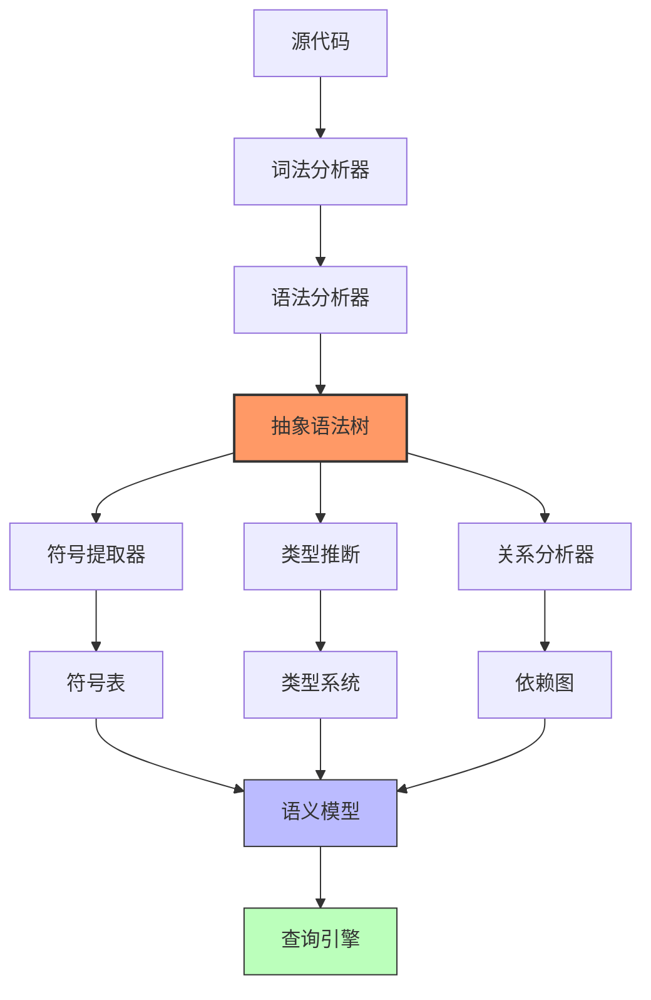
```mermaid
graph TD
    SourceCode[源代码] --> Tokenizer[词法分析器]
    Tokenizer --> Parser[语法分析器]
    Parser --> AST[抽象语法树]

    AST --> SymbolExtraction[符号提取器]
    AST --> TypeInference[类型推断]
    AST --> RelationshipAnalyzer[关系分析器]

    SymbolExtraction --> SymbolTable[符号表]
    TypeInference --> TypeSystem[类型系统]
    RelationshipAnalyzer --> DependencyGraph[依赖图]

    SymbolTable --> SemanticModel[语义模型]
    TypeSystem --> SemanticModel
    DependencyGraph --> SemanticModel

    SemanticModel --> QueryEngine[查询引擎]

    style AST fill:#f96,stroke:#333,stroke-width:2px
    style SemanticModel fill:#bbf,stroke:#333,stroke-width:1px
    style QueryEngine fill:#bfb,stroke:#333,stroke-width:1px
```

通过这些深度实现细节，GitHub Copilot Chat 能够高效地理解工作区并处理与模型的交互，提供一个强大而自然的 AI 编程助手体验。这些技术在大型代码库和复杂项目中尤其重要，使 AI 能够提供上下文相关的建议和响应。

## 9. MCP（Model Context Protocol）集成

### 9.1 MCP 概述

MCP（Model Context Protocol）是 VS Code 提供的一种协议，允许扩展和外部服务器为语言模型提供额外的上下文、工具和能力。GitHub Copilot Chat 通过 MCP 集成，极大地扩展了 AI 助手的功能范围和适应性。

#### 9.1.1 MCP 的核心功能

MCP 在 GitHub Copilot Chat 中支持以下核心功能：

1. **工具集成**：允许外部 MCP 服务器注册工具，供 Copilot Chat 的代理模式使用
2. **提示支持**：MCP 服务器可以定义可重用的提示模板，作为斜杠命令在聊天中使用
3. **资源管理**：支持 MCP 工具返回资源，可以在聊天中保存和共享
4. **模型采样**：允许 MCP 服务器向模型发送请求，实现更复杂的交互模式

### 9.2 MCP 架构与实现

Copilot Chat 中的 MCP 集成主要实现位于 [`src/extension/mcp/`](./src/extension/mcp/) 目录，核心组件包括：

#### 9.2.1 工具调用循环

[`mcpToolCallingLoop.tsx`](./src/extension/mcp/vscode-node/mcpToolCallingLoop.tsx) 实现了 MCP 特定的工具调用循环，继承自基础的 `ToolCallingLoop` 类：

```typescript
export class McpToolCallingLoop extends ToolCallingLoop<IMcpToolCallingLoopOptions> {
    public static readonly ID = 'mcpToolSetupLoop';

    // 重写获取端点的方法，确保使用支持工具调用的模型
    private async getEndpoint(request: ChatRequest) {
        let endpoint = await this.endpointProvider.getChatEndpoint(this.options.request);
        if (!endpoint.supportsToolCalls) {
            endpoint = await this.endpointProvider.getChatEndpoint('gpt-4.1');
        }
        return endpoint;
    }

    // 重写构建提示的方法，使用MCP特定的提示模板
    protected async buildPrompt(buildPromptContext: IBuildPromptContext, progress: Progress<ChatResponseReferencePart | ChatResponseProgressPart>, token: CancellationToken): Promise<IBuildPromptResult> {
        const endpoint = await this.getEndpoint(this.options.request);
        const renderer = PromptRenderer.create(
            this.instantiationService,
            endpoint,
            McpToolCallingLoopPrompt,
            {
                promptContext: buildPromptContext,
                ...this.options.props
            }
        );
        return await renderer.render(progress, token);
    }

    // 重写获取可用工具的方法，提供MCP特定的工具
    protected async getAvailableTools(): Promise<LanguageModelToolInformation[]> {
        return [{
            description: QuickInputTool.description,
            name: QuickInputTool.ID,
            inputSchema: QuickInputTool.schema,
            tags: [],
        }, {
            description: QuickPickTool.description,
            name: QuickPickTool.ID,
            inputSchema: QuickPickTool.schema,
            tags: [],
        }];
    }
}
```

MCP工具调用循环采用了以下核心机制：

1. **模型协商**：自动切换到支持工具调用的模型（如gpt-4.1）
2. **专用提示**：使用针对MCP服务器的特定提示模板
3. **工具注册**：提供特定于MCP交互的工具（如快速输入、选择工具）
4. **结果处理**：处理MCP工具的特殊返回值和资源

#### 9.2.2 提示构建

[`mcpToolCallingLoopPrompt.tsx`](./src/extension/mcp/vscode-node/mcpToolCallingLoopPrompt.tsx) 定义了 MCP 工具调用的提示模板，使用 `@vscode/prompt-tsx` 库构建结构化提示：

```typescript
export class McpToolCallingLoopPrompt extends PromptElement<IMcpToolCallingLoopProps> {
    async render() {
        const { packageType, packageName, packageVersion, pickRef, packageReadme } = this.props;
        const { history, toolCallRounds = [], toolCallResults = {} } = this.props.promptContext;

        // 处理工具调用结果
        for (const round of toolCallRounds) {
            for (const tool of round.toolCalls) {
                if (toolCallResults[tool.id]) {
                    // no-op
                } else if (tool.name === QuickInputTool.ID) {
                    toolCallResults[tool.id] = await QuickInputTool.invoke(pickRef, JSON.parse(tool.arguments));
                } else if (tool.name === QuickPickTool.ID) {
                    toolCallResults[tool.id] = await QuickPickTool.invoke(pickRef, JSON.parse(tool.arguments));
                }
            }
        }

        // 构建提示内容
        return (
            <>
                <HistoryWithInstructions flexGrow={1} passPriority historyPriority={700} history={history}>
                    <InstructionMessage>
                        {/* 系统指令部分 */}
                        <Tag name='instructions'>
                            您是读取文档和提取相关结果的专家。<br />
                            开发人员正在基于 {packageType} 包设置 Model Context Protocol (MCP) 服务器。
                            您的任务是为服务器创建匹配提供的 JSON 模式的配置。<br />
                            {/* 更多指令... */}
                        </Tag>
                        {/* 示例部分 */}
                        <Tag name='example'>
                            {/* 示例请求和响应... */}
                        </Tag>
                    </InstructionMessage>
                </HistoryWithInstructions>
                <UserMessage flexGrow={3}>
                    {/* 用户消息部分 */}
                    我想将 {packageType} 包 `{packageName}` 作为 MCP 服务器运行。这是其自述文件：<br />
                    <Tag name='readme'>{this.props.packageReadme}</Tag>
                    {/* 更多内容... */}
                </UserMessage>
            </>
        );
    }
}
```

MCP提示构建过程包括以下几个关键部分：

1. **上下文组装**：将MCP服务器信息（包名、类型、版本、自述文件）组织为结构化提示
2. **工具调用处理**：管理工具调用的生命周期和结果处理
3. **指令注入**：提供专门针对MCP服务器配置的任务指令
4. **示例提供**：包含示例请求和响应，帮助模型理解任务

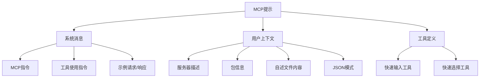
```mermaid
graph TD
    McpPrompt[MCP提示] --> SystemMessage[系统消息]
    McpPrompt --> UserContext[用户上下文]
    McpPrompt --> ToolDefinitions[工具定义]

    SystemMessage --> MCP_Instructions[MCP指令]
    SystemMessage --> Tool_Instructions[工具使用指令]
    SystemMessage --> Examples[示例请求/响应]

    UserContext --> ServerDescription[服务器描述]
    UserContext --> PackageInfo[包信息]
    UserContext --> ReadmeContent[自述文件内容]
    UserContext --> SchemaInfo[JSON模式]

    ToolDefinitions --> QuickInputTool[快速输入工具]
    ToolDefinitions --> QuickPickTool[快速选择工具]
```

#### 9.2.3 MCP 专用工具

[`mcpToolCallingTools.tsx`](./src/extension/mcp/vscode-node/mcpToolCallingTools.tsx) 提供了 MCP 特有的工具实现，这些工具设计用于收集用户配置信息：

1. **QuickInputTool**：允许通过VS Code的输入框获取用户输入，适用于短文本输入
   ```typescript
   export class QuickInputTool {
       public static readonly ID = 'getInput';
       public static readonly description = '提示用户输入短字符串。';
       public static readonly schema: JsonSchema = {
           type: 'object',
           properties: {
               id: { type: 'string', description: '此输入的唯一标识符' },
               title: { type: 'string', description: '输入框的标题' },
               placeholder: { type: 'string', description: '输入框的占位符文本' },
               value: { type: 'string', description: '输入框的初始值' },
           },
           required: ['id', 'title']
       };

       // 工具调用实现
       public static async invoke(pickRef: McpPickRef, args: IQuickInputToolArgs): Promise<string> {
           // 实现代码...
       }
   }
   ```

2. **QuickPickTool**：提供用户选择列表的工具，用于从预定义选项中选择
   ```typescript
   export class QuickPickTool {
       public static readonly ID = 'getPick';
       public static readonly description = '提示用户从列表中选择一个选项。';
       public static readonly schema: JsonSchema = {
           type: 'object',
           properties: {
               id: { type: 'string', description: '此选择的唯一标识符' },
               title: { type: 'string', description: '选择框的标题' },
               placeholder: { type: 'string', description: '选择框的占位符' },
               items: {
                   type: 'array',
                   description: '可供选择的项目',
                   items: {
                       type: 'object',
                       properties: {
                           label: { type: 'string', description: '要显示的标签' },
                           description: { type: 'string', description: '可选的描述' },
                           value: { type: 'string', description: '选择时返回的值' }
                       },
                       required: ['label', 'value']
                   }
               }
           },
           required: ['id', 'title', 'items']
       };

       // 工具调用实现
       public static async invoke(pickRef: McpPickRef, args: IQuickPickToolArgs): Promise<string> {
           // 实现代码...
       }
   }
   ```

这些工具使用 `McpPickRef` 类来管理VS Code的UI输入组件生命周期，确保工具调用可以等待用户输入并正确处理取消事件。

### 9.3 MCP 工具调用循环详解

MCP工具调用循环是MCP集成的核心机制，它负责模型和MCP服务器之间的交互。循环基于以下核心步骤：

1. **初始化提示**：构建包含MCP服务器信息和工具定义的提示
2. **模型请求**：将提示发送给语言模型，请求工具调用响应
3. **工具调用解析**：解析模型返回的工具调用请求
4. **工具执行**：执行工具调用，可能涉及用户交互
5. **结果反馈**：将工具调用结果反馈给模型
6. **迭代处理**：重复步骤2-5，直到模型完成任务
7. **最终响应**：生成最终的MCP配置或操作结果

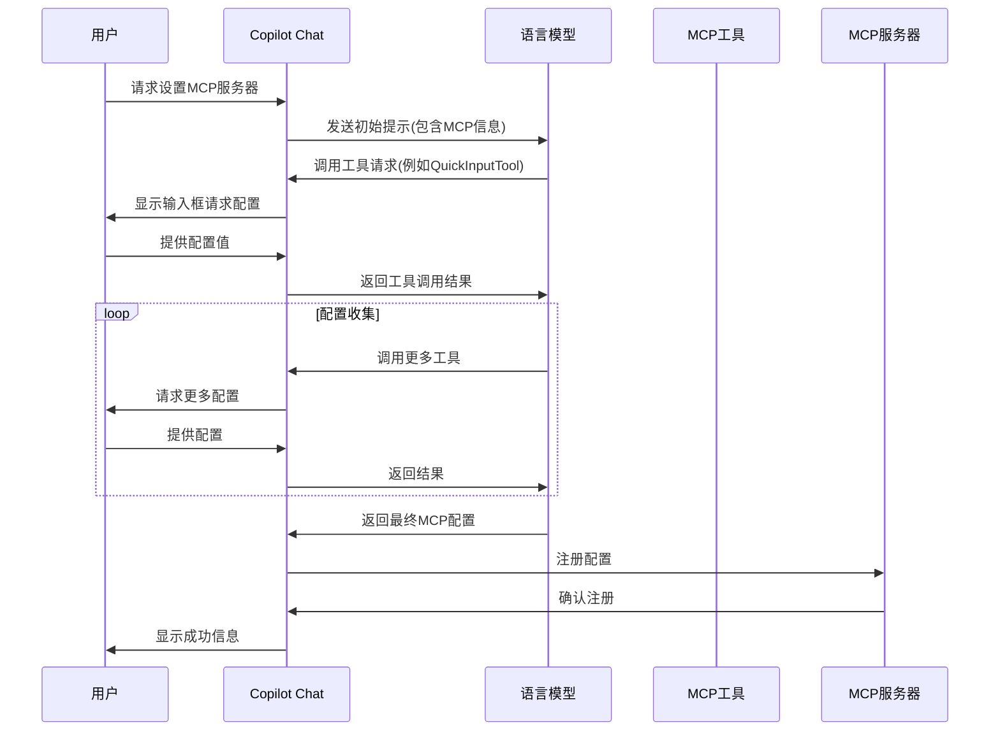
```mermaid
sequenceDiagram
    participant User as 用户
    participant Copilot as Copilot Chat
    participant Model as 语言模型
    participant Tools as MCP工具
    participant MCPServer as MCP服务器

    User->>Copilot: 请求设置MCP服务器
    Copilot->>Model: 发送初始提示(包含MCP信息)
    Model->>Copilot: 调用工具请求(例如QuickInputTool)
    Copilot->>User: 显示输入框请求配置
    User->>Copilot: 提供配置值
    Copilot->>Model: 返回工具调用结果

    loop 配置收集
        Model->>Copilot: 调用更多工具
        Copilot->>User: 请求更多配置
        User->>Copilot: 提供配置
        Copilot->>Model: 返回结果
    end

    Model->>Copilot: 返回最终MCP配置
    Copilot->>MCPServer: 注册配置
    MCPServer->>Copilot: 确认注册
    Copilot->>User: 显示成功信息
```

### 9.4 MCP 服务器集成

Copilot Chat 可以与多种 MCP 服务器集成，每个服务器可以提供专门的工具集和能力：

#### 9.4.1 服务器注册流程

```mermaid
sequenceDiagram
    participant MCPServer as MCP 服务器
    participant VSCode as VS Code
    participant Copilot as Copilot Chat

    MCPServer->>VSCode: 注册服务器
    VSCode->>Copilot: 通知新服务器
    Copilot->>VSCode: 请求服务器能力
    VSCode->>MCPServer: 获取能力描述
    MCPServer-->>VSCode: 返回工具/提示/资源定义
    VSCode-->>Copilot: 提供服务器能力

    Note over Copilot,MCPServer: 服务器注册完成

    Copilot->>VSCode: 使用MCP工具
    VSCode->>MCPServer: 转发工具调用
    MCPServer-->>VSCode: 返回工具结果
    VSCode-->>Copilot: 提供工具结果
```

#### 9.4.2 工具集成机制

VS Code 允许用户通过 UI 或 API 定义工具集，这是一组可以一起启用或禁用的相关工具的集合。Copilot Chat 中，MCP 工具通常按服务器分组到工具集中。

主要的工具集成类型包括：

1. **本地工具**：由 Copilot Chat 扩展自身提供
2. **扩展工具**：由其他 VS Code 扩展提供
3. **MCP 服务器工具**：由远程 MCP 服务器提供

```typescript
// 工具获取逻辑示例（简化）
async function getTools(context: ToolCallContext) {
    // 获取本地工具
    const localTools = this.getLocalTools();

    // 获取扩展工具
    const extensionTools = await vscode.languages.getLanguageModelTools();

    // 获取MCP服务器工具
    const mcpTools = await this.mcpService.getRegisteredTools();

    // 合并和过滤工具
    return this.filterTools([...localTools, ...extensionTools, ...mcpTools], context);
}
```

工具集成机制依赖于以下关键组件：

1. **工具注册表**：维护所有可用工具的中央注册表
   ```typescript
   export interface IToolRegistry {
       // 注册新工具
       registerTool(tool: Tool): IDisposable;

       // 获取特定上下文的可用工具
       getTools(context: ToolCallContext): Promise<Tool[]>;

       // 查找特定工具
       getTool(name: string): Tool | undefined;
   }
   ```

2. **工具定义**：标准化的工具定义接口
   ```typescript
   export interface Tool {
       // 工具的唯一标识符
       name: string;

       // 工具的描述
       description: string;

       // 工具参数的JSON模式
       schema: JsonSchema;

       // 工具调用实现
       invoke(args: any): Promise<any>;

       // 工具的附加标签（可选）
       tags?: string[];

       // 工具的可用模式（默认、代理等）
       mode?: CopilotToolMode;
   }
   ```

3. **工具模式**：工具的可用环境设置
   ```typescript
   export enum CopilotToolMode {
       // 可在所有上下文使用
       Default = 'default',

       // 仅在代理模式下可用
       Agent = 'agent',

       // 仅在MCP上下文中可用
       Mcp = 'mcp'
   }
   ```

4. **工具调用循环**：实现完整的工具调用循环，包括提示构建、模型请求、工具执行和结果反馈
   ```typescript
   export class ToolCallingLoop<T extends IToolCallingLoopOptions> {
       // 工具调用循环的ID
       public static readonly ID = 'toolSetupLoop';

       // 初始化循环
       constructor(options: T, ...) { ... }

       // 启动循环
       public async start(progress: Progress<ChatResponseProgressPart>, token: CancellationToken): Promise<void> {
           // 实现代码...
       }

       // 构建提示
       protected async buildPrompt(...): Promise<IBuildPromptResult> { ... }

       // 获取可用工具
       protected async getAvailableTools(): Promise<LanguageModelToolInformation[]> { ... }

       // 执行模型请求
       protected async fetch(...): Promise<ChatResponse> { ... }

       // 处理工具调用
       protected async handleToolCalls(...): Promise<void> { ... }
   }
   ```

MCP工具集成使用了VS Code的 `languages.registerLanguageModelToolProvider` API 和 Copilot Chat 内部的工具注册机制相结合，确保MCP服务器提供的工具可以无缝集成到代理模式中。

### 9.5 MCP 资源与提示支持

#### 9.5.1 资源支持

MCP工具可以返回资源，这些资源在Copilot Chat中通过专门的资源管理系统处理：

1. **资源类型**：支持的资源类型包括：
   - 文本资源（如代码片段、配置文件）
   - 图像资源（如图表、截图）
   - 文件资源（如项目模板、数据文件）

2. **资源处理流程**：
   ```typescript
   // 资源接口（简化）
   export interface MCPResource {
       id: string;
       name: string;
       contentType: string;
       content: string | Uint8Array;
       metadata?: Record<string, any>;
   }

   // 资源处理器
   export class MCPResourceHandler {
       // 注册资源
       registerResource(resource: MCPResource): string {
           // 资源存储和ID生成...
           return resourceId;
       }

       // 获取资源
       getResource(id: string): MCPResource | undefined {
           // 资源查找...
           return this.resources.get(id);
       }

       // 保存资源到文件系统
       async saveResource(id: string, path?: string): Promise<string> {
           // 资源保存逻辑...
           return savedPath;
       }
   }
   ```

3. **资源操作**：资源可以通过以下方式使用：
   - **保存**：通过"保存"按钮或拖放到资源管理器中保存到文件系统
   - **上下文添加**：通过"添加上下文"按钮添加到聊天上下文中
   - **浏览**：使用 `MCP: Browse Resources` 命令浏览和查看所有可用资源

4. **资源生命周期**：
   - 创建：由MCP工具返回或由MCP服务器主动提供
   - 存储：临时存储在内存中或持久化到扩展存储
   - 使用：在聊天中显示、保存到文件系统或添加到上下文
   - 清理：随会话结束或手动清理

```mermaid
flowchart TD
    ToolReturn[工具返回资源] --> ResourceReg[资源注册]
    ResourceReg --> TempStorage[临时存储]

    TempStorage --> DisplayInChat[在聊天中显示]
    TempStorage --> AddToContext[添加到上下文]
    TempStorage --> SaveToFS[保存到文件系统]

    DisplayInChat --> UserInteraction[用户交互]
    UserInteraction --> AddToContext
    UserInteraction --> SaveToFS

    subgraph 资源操作
    DisplayInChat
    AddToContext
    SaveToFS
    end
```

#### 9.5.2 提示支持

MCP 服务器可以定义提示模板，Copilot Chat 将这些提示作为斜杠命令公开，格式为 `/mcp.servername.promptname`：

1. **提示定义**：MCP服务器在注册时提供提示定义
   ```typescript
   // 提示模板接口（简化）
   export interface MCPPromptTemplate {
       id: string;
       name: string;
       description: string;
       template: string;
       variables?: MCPPromptVariable[];
       tags?: string[];
   }

   // 提示变量
   export interface MCPPromptVariable {
       name: string;
       description: string;
       defaultValue?: string;
       required: boolean;
   }
   ```

2. **提示注册**：MCP提示通过专用提示注册表进行管理
   ```typescript
   export class MCPPromptRegistry {
       private readonly prompts = new Map<string, MCPPromptTemplate>();

       // 注册新提示
       registerPrompt(prompt: MCPPromptTemplate): IDisposable {
           const id = `mcp.${prompt.id}`;
           this.prompts.set(id, prompt);
           // 返回注销处理程序...
       }

       // 获取可用提示
       getPrompts(): MCPPromptTemplate[] {
           return Array.from(this.prompts.values());
       }

       // 获取特定提示
       getPrompt(id: string): MCPPromptTemplate | undefined {
           return this.prompts.get(id);
       }
   }
   ```

3. **提示执行流程**：

```mermaid
graph TD
    UserInput["用户输入: /mcp.server.prompt"] --> ParseCommand[解析命令]
    ParseCommand --> FetchPrompt[获取提示模板]
    FetchPrompt --> CollectVars{需要变量?}

    CollectVars -- 是 --> PromptVars[收集变量值]
    CollectVars -- 否 --> RenderPrompt[渲染提示]
    PromptVars --> RenderPrompt

    RenderPrompt --> SendToModel[发送到模型]
    SendToModel --> DisplayResult[显示结果]

    subgraph 变量收集
    CollectVars
    PromptVars
    end
```

4. **提示执行代码**：
   ```typescript
   // 提示执行（简化）
   async function executeMcpPrompt(promptId: string) {
       // 获取提示模板
       const prompt = mcpPromptRegistry.getPrompt(promptId);
       if (!prompt) {
           throw new Error(`找不到ID为 ${promptId} 的MCP提示`);
       }

       // 收集变量值
       const variableValues = new Map<string, string>();
       if (prompt.variables && prompt.variables.length > 0) {
           for (const variable of prompt.variables) {
               const value = await promptForVariable(variable);
               variableValues.set(variable.name, value);
           }
       }

       // 渲染提示
       const renderedPrompt = renderPromptTemplate(prompt.template, variableValues);

       // 发送到模型并处理响应
       const response = await sendToLanguageModel(renderedPrompt);

       // 显示结果
       return response;
   }
   ```

### 9.6 MCP 集成的优势

1. **扩展性**：允许 Copilot Chat 轻松集成第三方服务和数据源
2. **专业化**：不同的 MCP 服务器可以提供领域特定的工具和能力
3. **灵活性**：工具集可以根据用户需求动态启用或禁用
4. **标准化**：通过统一协议简化工具和服务的集成
5. **安全性**：提供权限控制和请求确认机制

#### 9.6.1 MCP集成案例

以下是MCP集成的一些实际应用场景：

1. **数据库查询**：MCP服务器提供SQL查询工具，允许Copilot直接访问和查询数据库
2. **云资源管理**：提供Azure或AWS资源管理工具，便于查询和操作云资源
3. **代码分析**：集成高级代码分析工具，提供超出基本语义搜索的深度代码洞察
4. **专业领域支持**：提供特定领域（如医疗、金融、法律）的知识和工具
5. **内部系统集成**：企业可以集成内部系统和数据源，提供组织特定的功能

#### 9.6.2 未来发展方向

MCP集成正在快速发展，未来可能的方向包括：

1. **功能层面**：
   - **自定义工具链**：用户定义和共享专门的工具链组合
   - **跨会话状态**：MCP 服务器维护跨会话的上下文和状态
   - **高级资源类型**：支持交互式资源和复杂数据可视化
   - **多模态交互**：扩展到图像、音频等多模态输入/输出

2. **技术层面**：
   - **标准化协议升级**：MCP 协议的持续演进和标准化
   - **性能优化**：提高大规模工具调用的效率和响应速度
   - **联邦学习集成**：与联邦学习系统集成，支持本地模型训练
   - **工具市场**：建立 MCP 工具和服务的共享市场

3. **生态层面**：
   - **垂直领域工具集**：针对特定行业的专业 MCP 服务器
   - **企业集成框架**：简化企业内部系统的 MCP 集成
   - **跨平台扩展**：将 MCP 概念扩展到其他开发环境和平台
   - **社区驱动发展**：开源 MCP 服务器和工具的壮大

MCP 的出现标志着 AI 编码助手从封闭系统向开放平台的转变，未来它将成为连接 AI 模型和专业工具的通用接口，极大地扩展了 Copilot Chat 的应用场景和价值。通过持续的技术创新和生态建设，MCP 集成将进一步强化 GitHub Copilot Chat 在 AI 辅助编码领域的领先地位。

### 9.7 MCP 的技术实现与通信机制

#### 9.7.1 MCP 服务器通信协议

MCP 服务器与 VS Code 之间的通信支持两种主要协议：

1. **SSE (Server-Sent Events)**：一种基于HTTP的单向通信机制，用于从服务器向客户端推送更新
   ```typescript
   // SSE服务器配置示例
   interface McpSseServerConfig {
       type: 'sse';
       url: string;
       auth?: {
           type: 'header' | 'query';
           name: string;
           value: string;
       };
   }
   ```

2. **流式HTTP**：双向流式通信，允许更高效的数据交换和实时反馈
   ```typescript
   // 流式HTTP服务器配置示例
   interface McpStreamableHttpServerConfig {
       type: 'streamable-http';
       url: string;
       auth?: {
           type: 'header' | 'query';
           name: string;
           value: string;
       };
   }
   ```

Copilot Chat 通过 VS Code API 与 MCP 服务器通信，实现了对两种协议的兼容支持：

```typescript
// MCP服务器通信管理器（简化）
export class McpServerCommunicationManager {
    private readonly serverConnections = new Map<string, McpServerConnection>();

    // 创建服务器连接
    async createConnection(config: McpServerConfig): Promise<McpServerConnection> {
        const connection = config.type === 'sse'
            ? new McpSseServerConnection(config)
            : new McpStreamableHttpServerConnection(config);

        await connection.connect();
        this.serverConnections.set(config.id, connection);
        return connection;
    }

    // 发送请求到服务器
    async sendRequest(serverId: string, request: McpRequest): Promise<McpResponse> {
        const connection = this.serverConnections.get(serverId);
        if (!connection) {
            throw new Error(`未找到ID为 ${serverId} 的MCP服务器连接`);
        }

        return connection.sendRequest(request);
    }
}
```

#### 9.7.2 MCP 命令与 API

Copilot Chat 通过一系列命令和 API 提供 MCP 服务器的管理和交互功能：

1. **服务器管理命令**：
   - **`MCP: List Servers`**：列出所有已注册的 MCP 服务器
   - **`MCP: Add Server`**：添加新的 MCP 服务器
   - **`MCP: Remove Server`**：移除已注册的 MCP 服务器
   - **`MCP: Edit Server Configuration`**：编辑服务器配置

2. **资源管理命令**：
   - **`MCP: Browse Resources`**：浏览所有可用的 MCP 资源
   - **`MCP: Save Resource`**：保存资源到文件系统
   - **`MCP: Add Resource to Context`**：将资源添加到聊天上下文

3. **API 集成**：Copilot Chat 使用 VS Code 的语言模型相关 API 与 MCP 服务器集成：
   ```typescript
   // 注册MCP服务器提供的工具
   vscode.languages.registerLanguageModelToolProvider({
       provideLanguageModelTools(context) {
           // 根据上下文返回MCP工具
           return getMcpTools(context);
       }
   });

   // 注册MCP服务器提供的提示
   vscode.commands.registerCommand('github.copilot.registerMcpPrompts', async (server, prompts) => {
       // 注册MCP提示
       mcpPromptRegistry.registerPrompts(server, prompts);
   });
   ```

#### 9.7.3 MCP 工具调用技术实现

MCP 工具调用的关键技术实现包括：

1. **工具定义与验证**：使用 JSON Schema 进行工具定义和参数验证
   ```typescript
   // 工具模式标准化和验证
   export function normalizeToolSchema(tool: LanguageModelTool): LanguageModelTool {
       try {
           // 验证工具模式是否符合JSON Schema标准
           const validator = new JsonSchemaValidator();
           validator.validate(tool.function.parameters, metaSchema);

           // 返回规范化的工具定义
           return {
               ...tool,
               function: {
                   ...tool.function,
                   parameters: normalizeSchema(tool.function.parameters)
               }
           };
       } catch (e) {
           // 处理验证错误
           throw new Error(`工具 ${tool.function.name} 验证失败: ${e}`);
       }
   }
   ```

2. **工具执行与错误处理**：安全的工具调用执行和错误处理机制
   ```typescript
   // 工具调用执行（简化）
   async function executeToolCall(toolCall: ToolCall): Promise<ToolCallResult> {
       try {
           // 获取工具实现
           const tool = toolRegistry.getTool(toolCall.name);
           if (!tool) {
               throw new Error(`未找到工具: ${toolCall.name}`);
           }

           // 解析参数
           const args = JSON.parse(toolCall.arguments);

           // 验证参数
           validateToolArguments(tool.schema, args);

           // 执行工具调用
           const result = await tool.invoke(args);

           // 返回成功结果
           return {
               id: toolCall.id,
               type: 'success',
               result: JSON.stringify(result)
           };
       } catch (error) {
           // 返回错误结果
           return {
               id: toolCall.id,
               type: 'error',
               error: error.message
           };
       }
   }
   ```

3. **并行工具调用**：支持多个工具的并行调用和结果聚合
   ```typescript
   // 并行工具调用（简化）
   async function executeToolCalls(toolCalls: ToolCall[]): Promise<ToolCallResult[]> {
       // 并行执行所有工具调用
       const results = await Promise.all(
           toolCalls.map(toolCall => executeToolCall(toolCall))
       );

       return results;
   }
   ```

4. **工具调用循环**：实现完整的工具调用循环，包括提示构建、模型请求、工具执行和结果反馈
   ```typescript
   // 工具调用循环（简化）
   async function runToolCallingLoop(query: string, toolSet: string): Promise<string> {
       // 初始化工具集
       const tools = await getToolSet(toolSet);

       // 构建初始提示
       const prompt = buildToolCallingPrompt(query, tools);

       // 初始模型请求
       let response = await requestLanguageModel(prompt);

       // 循环处理工具调用
       while (response.toolCalls && response.toolCalls.length > 0) {
           // 执行工具调用
           const toolCallResults = await executeToolCalls(response.toolCalls);

           // 将结果反馈给模型
           response = await requestLanguageModelWithResults(response.message, toolCallResults);
       }

       // 返回最终响应
       return response.message;
   }
   ```

#### 9.7.4 MCP 安全性与权限控制

Copilot Chat 实现了严格的 MCP 安全机制：

1. **首次使用确认**：首次使用 MCP 服务器时，用户需要确认允许访问
   ```typescript
   // 首次使用确认（简化）
   async function confirmMcpServerAccess(serverId: string): Promise<boolean> {
       const server = mcpRegistry.getServer(serverId);
       if (!server) {
           return false;
       }

       // 检查是否已经确认过
       if (hasConfirmedAccess(serverId)) {
           return true;
       }

       // 请求用户确认
       const result = await vscode.window.showWarningMessage(
           `是否允许 MCP 服务器 "${server.name}" 访问您的 VS Code？`,
           { modal: true },
           '允许',
           '拒绝'
       );

       // 记录用户选择
       if (result === '允许') {
           recordConfirmedAccess(serverId);
           return true;
       }

       return false;
   }
   ```

2. **模型访问控制**：MCP 服务器对模型的访问是受控的，用户可以配置允许的模型
   ```typescript
   // 模型访问控制配置（简化）
   interface McpModelAccessConfig {
       serverId: string;
       allowedModels: string[];
       maxTokens: number;
       requestsPerMinute: number;
   }

   // 检查模型访问权限
   function checkModelAccess(serverId: string, modelId: string): boolean {
       const config = getModelAccessConfig(serverId);
       return config.allowedModels.includes(modelId);
   }
   ```

3. **请求日志**：记录所有 MCP 服务器发出的请求，便于审计和调试
   ```typescript
   // 请求日志记录（简化）
   function logMcpRequest(serverId: string, request: McpRequest): void {
       const logEntry = {
           timestamp: new Date().toISOString(),
           serverId,
           requestType: request.type,
           requestId: request.id,
           // 其他相关信息...
       };

       mcpRequestLogger.log(logEntry);
   }
   ```

4. **资源访问控制**：控制 MCP 服务器对 VS Code 资源的访问
   ```typescript
   // 资源访问权限检查（简化）
   async function checkResourceAccess(serverId: string, resourceType: string, resourcePath: string): Promise<boolean> {
       const server = mcpRegistry.getServer(serverId);
       if (!server) {
           return false;
       }

       // 检查服务器权限
       if (!server.permissions.includes(resourceType)) {
           return false;
       }

       // 对于敏感操作，请求用户确认
       if (isSensitiveResourceOperation(resourceType, resourcePath)) {
           return await requestUserConfirmation(serverId, resourceType, resourcePath);
       }

       return true;
   }
   ```

MCP 的技术实现体现了 Copilot Chat 对安全性、可扩展性和用户体验的重视，通过标准化的协议和严格的权限控制，在提供强大功能的同时确保了用户数据的安全和隐私。

### 9.8 MCP 在 Copilot Chat 架构中的作用与发展

Model Context Protocol 集成是 GitHub Copilot Chat 架构中的关键创新点，它将静态的 AI 助手转变为一个可扩展的开放平台。MCP 不仅扩展了 Copilot Chat 的功能边界，还为整个 VS Code 生态系统提供了标准化的 AI 集成机制。

#### 9.8.1 MCP 在整体架构中的定位

在 Copilot Chat 的整体架构中，MCP 扮演着连接内部系统和外部服务的桥梁角色：

1. **横向扩展能力**：允许 Copilot Chat 横向扩展，集成各种专业工具和数据源
2. **垂直深度增强**：提供特定领域的深度功能，超越通用 AI 助手的能力范围
3. **开放生态支持**：为第三方开发者提供扩展 Copilot Chat 的标准方式
4. **特定场景定制**：支持为特定开发场景和工作流提供专门的 AI辅助

```mermaid
graph LR
    CopilotCore[Copilot Chat 核心] --- MCP[MCP 集成层]

    MCP --- DevTools[开发工具]
    MCP --- DataSources[数据源]
    MCP --- CustomServices[定制服务]
    MCP --- EnterpriseSystem[企业系统]

    style MCP fill:#f9f,stroke:#333,stroke-width:2px
```

#### 9.8.2 未来发展方向

随着 MCP的不断成熟和采用，未来的发展方向可能包括：

1. **功能层面**：
   - **自定义工具链**：用户定义和共享专门的工具链组合
   - **跨会话状态**：MCP 服务器维护跨会话的上下文和状态
   - **高级资源类型**：支持交互式资源和复杂数据可视化
   - **多模态交互**：扩展到图像、音频等多模态输入/输出

2. **技术层面**：
   - **标准化协议升级**：MCP 协议的持续演进和标准化
   - **性能优化**：提高大规模工具调用的效率和响应速度
   - **联邦学习集成**：与联邦学习系统集成，支持本地模型训练
   - **工具市场**：建立 MCP 工具和服务的共享市场

3. **生态层面**：
   - **垂直领域工具集**：针对特定行业的专业 MCP 服务器
   - **企业集成框架**：简化企业内部系统的 MCP 集成
   - **跨平台扩展**：将 MCP 概念扩展到其他开发环境和平台
   - **社区驱动发展**：开源 MCP 服务器和工具的壮大

MCP 的出现标志着 AI 编码助手从封闭系统向开放平台的转变，未来它将成为连接 AI 模型和专业工具的通用接口，极大地扩展了 Copilot Chat 的应用场景和价值。通过持续的技术创新和生态建设，MCP 集成将进一步强化 GitHub Copilot Chat 在 AI 辅助编码领域的领先地位。
