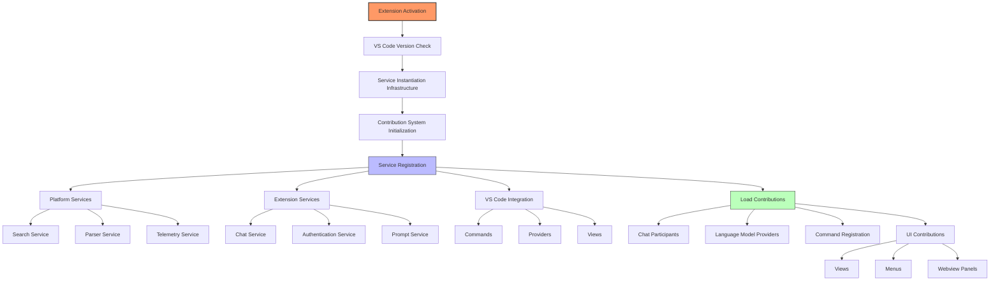
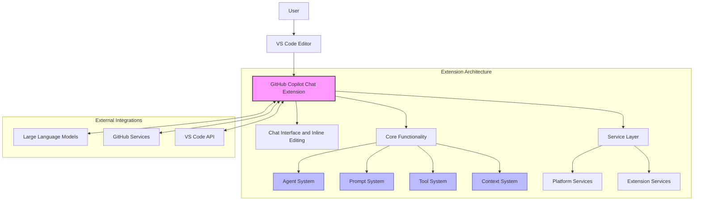
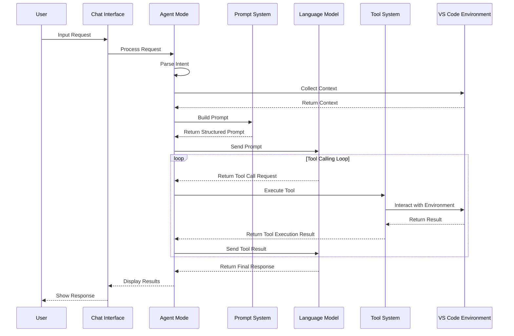
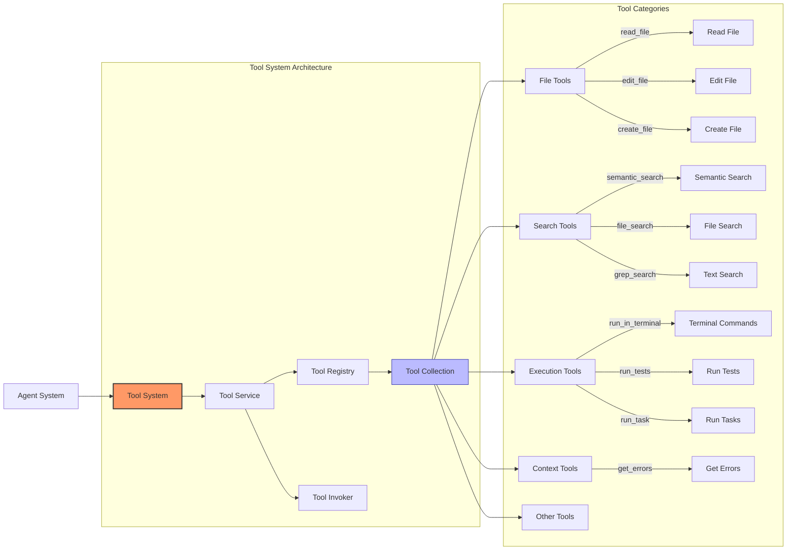
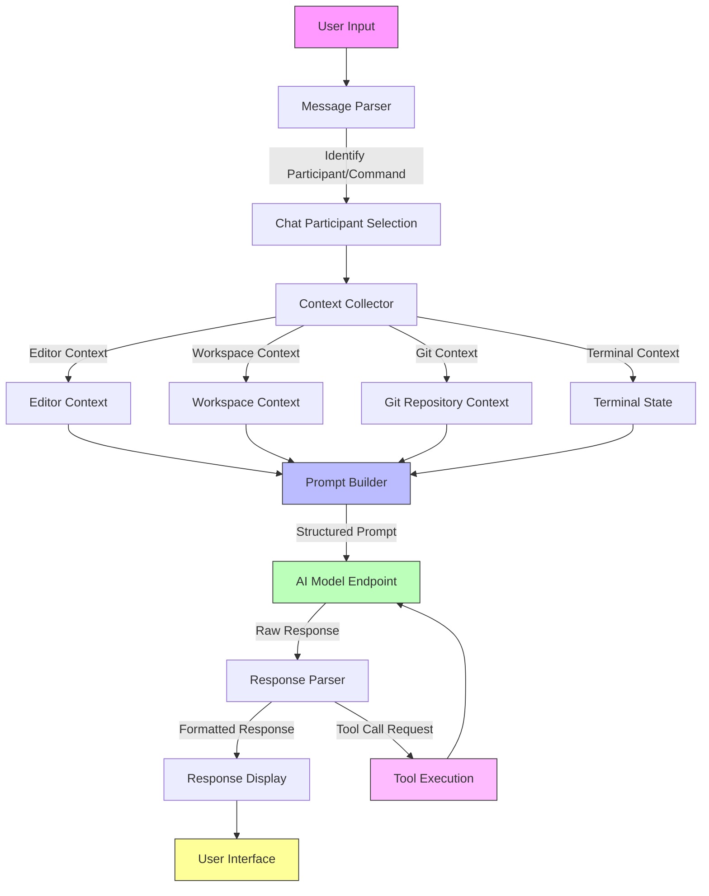

# GitHub Copilot Chat Extension Architecture Analysis

GitHub Copilot Chat is a Visual Studio Code extension that provides AI-driven conversational assistance for coding. It's a companion extension to GitHub Copilot, adding chat functionality and advanced intelligent agent capabilities. This document analyzes its architecture, key components, and working principles.

## 1. Project Overview

### 1.1 Basic Information

- **Project Name**: GitHub Copilot Chat
- **Functional Description**: Provides AI conversational coding assistance within VS Code
- **Key Features**:
  - Chat Interface: Provides conversational AI assistance, chat participants, variables, and slash commands
  - Inline Chat: AI-powered editing directly in the editor (using `Ctrl+I`)
  - Agent Mode: Multi-step autonomous coding tasks
  - Edit Mode: Natural language to code conversion
  - Code Completions: Next edit suggestions and inline completions
  - Language Model Integration: Support for multiple AI models (GPT-4, Claude, Gemini, etc.)
  - Context-Aware: Workspace understanding, semantic search, and code analysis

### 1.2 Tech Stack

- **Primary Language**: TypeScript (follows VS Code coding standards)
- **Frontend Framework**: TSX (using the @vscode/prompt-tsx library for prompts)
- **Runtime Environment**: Node.js (for extension host and language server features)
- **Performance Optimization**: WebAssembly (for performance-critical parsing and tokenization)
- **API Integration**: VS Code Extension API (extensive use of proposed APIs)
- **Build Tools**: ESBuild (bundling and compilation)
- **Testing Framework**: Vitest (unit testing)
- **Other Languages**: Python (for notebooks integration and ML evaluation scripts)

## 2. Project Architecture

### 2.1 Directory Structure

GitHub Copilot Chat's source code is mainly divided into the following parts:

- **[`src/extension/`](./src/extension/)**: Main extension implementation, organized by feature
- **[`src/platform/`](./src/platform/)**: Shared platform services and utilities
- **[`src/util/`](./src/util/)**: Common utilities, VS Code API abstractions, and service infrastructure

#### Key Source Directories

Core directories for extension feature implementation:

- **[`src/extension/conversation/`](./src/extension/conversation/)**: Chat participants, agents, and conversation flow orchestration
- **[`src/extension/inlineChat/`](./src/extension/inlineChat/)**: Inline editing features (`Ctrl+I`) and hints system
- **[`src/extension/inlineEdits/`](./src/extension/inlineEdits/)**: Advanced inline editing capabilities with streaming edits
- **[`src/extension/context/`](./src/extension/context/)**: Context resolution for code understanding and workspace analysis
- **[`src/extension/prompts/`](./src/extension/prompts/)**: [Prompt engineering and template system](#31-core-prompt-system)
- **[`src/extension/tools/`](./src/extension/tools/)**: Language model tools and integrations
- **[`src/extension/intents/`](./src/extension/intents/)**: Chat participant and slash command implementations

Platform services directories:

- **[`src/platform/chat/`](./src/platform/chat/)**: Core chat services and conversation options
- **[`src/platform/openai/`](./src/platform/openai/)**: OpenAI API protocol integration and request handling
- **[`src/platform/embedding/`](./src/platform/embedding/)**: Vector embeddings for semantic search
- **[`src/platform/parser/`](./src/platform/parser/)**: Code parsing and AST analysis
- **[`src/platform/workspace/`](./src/platform/workspace/)**: Workspace understanding and file management

### 2.2 Layer Structure

The project uses a layered architecture design:

1. **common layer**: Uses only JavaScript and built-in APIs, can use VS Code API types but not access them at runtime
2. **vscode layer**: Runtime access to VS Code API, can use common layer
3. **node layer**: Node.js APIs and modules, can use common layer
4. **vscode-node layer**: VS Code API and Node.js API, can use common, vscode, and node layers
5. **worker layer**: Web Worker API, can use common layer
6. **vscode-worker layer**: VS Code API and Web Worker API, can use common, vscode, and worker layers

### 2.3 Runtime Environments

Copilot supports two runtime environments:

- **Node.js extension host**: Using [`./extension/extension/vscode-node/extension.ts`](./src/extension/extension/vscode-node/extension.ts)
- **Web Worker extension host**: Using [`./extension/extension/vscode-worker/extension.ts`](./src/extension/extension/vscode-worker/extension.ts)

### 2.4 Extension Activation Flow

1. **Base Activation** ([`src/extension/extension/vscode/extension.ts`](./src/extension/extension/vscode/extension.ts)):
   - Checks VS Code version compatibility
   - Creates service instantiation infrastructure
   - Initializes contribution system

2. **Service Registration**:
   - Platform services (search, parsing, telemetry, etc.)
   - Extension-specific services (chat, authentication, etc.)
   - VS Code integrations (commands, providers, etc.)

3. **Contribution Loading**:
   - Chat participants
   - Language model providers
   - Command registrations
   - UI contributions (views, menus, etc.)

The following diagram shows the main flow of extension activation and the order of component registration:



This flowchart shows the main steps in the extension activation process, from initial activation to service registration and contribution loading. This layered initialization process ensures that all necessary components are properly initialized and registered before being used by other components.

### 2.5 Architecture Overview Diagram

The following diagram shows the overall architecture of GitHub Copilot Chat and the relationships between its major components:



This architecture diagram shows how the user interacts with the GitHub Copilot Chat extension through VS Code, and the main components within the extension and its external integrations.

## 3. Core Component Analysis

### 3.1 Core Prompt System

Copilot Chat's prompt system is a declarative prompt engineering system based on TSX. The core files are located at:

- **[`agentPrompt.tsx`](./src/extension/prompts/node/agent/agentPrompt.tsx)**: Main entry point for agent mode prompts
- **[`agentInstructions.tsx`](./src/extension/prompts/node/agent/agentInstructions.tsx)**: System prompts for agent mode

The agent mode prompt includes several key components:

1. **`AgentPrompt`** class: Main prompt coordinator that handles overall agent prompt rendering
2. **`DefaultAgentPrompt`** class: Standard agent behavior instructions
3. **`SweBenchAgentPrompt`** class: Advanced problem-solving mode instructions
4. **`AgentUserMessage`** class: Handles user input and environment context
5. **`GlobalAgentContext`** class: Provides environment and workspace information

The prompt system uses TSX to build, making prompts more structured and maintainable:

```tsx
async render(state: void, sizing: PromptSizing) {
    const instructions = this.configurationService.getConfig(ConfigKey.Internal.SweBenchAgentPrompt) ?
        <SweBenchAgentPrompt availableTools={this.props.promptContext.tools?.availableTools} modelFamily={this.props.endpoint.family} codesearchMode={undefined} /> :
        <DefaultAgentPrompt
            availableTools={this.props.promptContext.tools?.availableTools}
            modelFamily={this.props.endpoint.family}
            codesearchMode={this.props.codesearchMode}
        />;

    const baseInstructions = <>
        <SystemMessage>
            You are an expert AI programming assistant, working with a user in the VS Code editor.<br />
            <CopilotIdentityRules />
            <SafetyRules />
        </SystemMessage>
        // ...other prompt components
    </>;
}
```

### 3.2 Agent Mode Implementation

Agent mode is a core feature of Copilot Chat, allowing the AI to autonomously execute multi-step coding tasks. Key implementation files:

- **[`toolCallingLoop.ts`](./src/extension/intents/node/toolCallingLoop.ts)**: Runs the agent loop
- **[`chatParticipants.ts`](./src/extension/conversation/vscode-node/chatParticipants.ts)**: Registers agent mode and other participants
- **[`agentIntent.ts`](./src/extension/intents/node/agentIntent.ts)**: Agent intent processing

Agent mode workflow:

1. **Request Analysis**: Parse user input, including participants, variables, and commands
2. **Context Collection**: Gather relevant code context, diagnostics, and workspace information
3. **Prompt Construction**: Build prompts based on context and intent detection
4. **Model Interaction**: Send requests to the appropriate language models
5. **Response Processing**: Parse and interpret AI responses
6. **Tool Execution**: Apply code edits, show results, handle follow-ups

The following diagram shows the workflow of agent mode and interactions between key components:



This sequence diagram illustrates how agent mode executes complex multi-step tasks through the tool calling loop. The agent first collects context and builds a prompt, then engages in multiple rounds of interaction with the language model, receiving tool call requests and executing them until the task is completed and a final response is returned.

### 3.3 Tool System

The tool system is a core part of agent mode, allowing the AI to interact with the VS Code environment. Tool definitions and implementations are located at:

- **[`package.json`](./package.json)**: Tool descriptions and schemas
- **[`toolNames.ts`](./src/extension/tools/common/toolNames.ts)**: Model-facing tool names
- **[`tools/`](./src/extension/tools/node/)**: Tool implementations

Main tool categories include:

1. **Core Development Tools**:
   - Read file (`read_file`)
   - Edit file (`insert_edit_into_file`, `replace_string_in_file`)
   - Run terminal commands (`run_in_terminal`)

2. **Analysis Tools**:
   - Semantic search (`semantic_search`)
   - File search (`file_search`)
   - Text search (`grep_search`)

3. **Execution Tools**:
   - Run tasks (`run_vs_code_task`)
   - Run tests (`run_tests`)
   - Execute notebook cells (`run_notebook_cell`)

4. **Other Tools**:
   - Create file (`create_file`)
   - Get errors (`get_errors`)
   - Update user preferences (`update_user_preferences`)

The following diagram shows the architecture of the tool system and main tool categories:



This diagram shows the main components and categories of the tool system. The tool system is central to the agent's capabilities, enabling AI to effectively interact with the VS Code environment through various tool categories (file operations, search, execution, etc.).

### 3.4 Chat System

The chat system is the primary way users interact with the AI. Core components:

#### Chat Participants
- **Default Agent**: Main conversational AI assistant
- **Setup Agent**: Handles initial Copilot setup and onboarding
- **Workspace Agent**: Specialized for workspace-wide operations
- **Agent Mode**: Autonomous multi-step task execution

Implementation is in the [`src/extension/conversation/`](./src/extension/conversation/) directory.

#### Message Processing Flow

The message processing flow involves multiple steps:

1. Receive user input
2. Parse participants and commands
3. Collect context
4. Build prompt
5. Interact with AI model
6. Process response and display results

The following diagram shows the message processing flow in the chat system:


